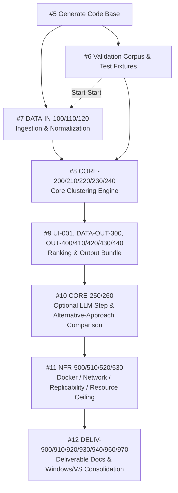

# Implementation Plan

<!--
Owned by the Systems Engineer, built in collaboration with Solutions
Architect's docs/PROJECT_DEFINITION.md. Sequences the build so the
most critical MVP items come first.
-->

## Why a single linear order

<a href="https://github.com/HoloSim-Interactive/NAADAP/blob/main/docs/PROJECT_DEFINITION.md" target="_blank">docs/PROJECT_DEFINITION.md</a> describes one MVP with a hard submission
deadline (2026-09-22), not a product expected to grow through
distinct phases with independently varying complexity/UI/documentation
rigor — the three-axis phase table in the template below does not
apply here and has been omitted. The pipeline itself is also
inherently sequential (each stage's output is the next stage's input —
see <a href="https://github.com/HoloSim-Interactive/NAADAP/blob/main/docs/SDD.md#sdd-data-architecture" target="_blank">docs/SDD.md's Data Architecture</a> run-scoped data flow), so a
single priority-ordered sequence is both the simplest plan and an
accurate reflection of the real dependency graph, not a
simplification of it.

There is also no UI Designer or Scene Developer track: <a href="https://github.com/HoloSim-Interactive/NAADAP/blob/main/docs/SDD.md#sdd-why-no-use-case-diagram-icd" target="_blank">docs/SDD.md's
"Why no use case diagram / ICD" section</a> confirms this is a batch
analysis + report deliverable with one actor (an operator or CI job
invoking the container). Every downstream issue's owner is Software
Engineer.

## Build Sequence

1. **Generate Code Base** (<a href="https://github.com/HoloSim-Interactive/NAADAP/issues/5" target="_blank">#5</a>) — scaffolds the `Naadap.sln` layout from
   <a href="https://github.com/HoloSim-Interactive/NAADAP/blob/main/docs/SDD.md#sdd-build-toolchain-conventions" target="_blank">docs/SDD.md Coding Standards</a>, with the Core/Alternative/LlmStep
   assembly separation in place from the start (load-bearing for
   <a href="https://github.com/HoloSim-Interactive/NAADAP/blob/main/docs/RTVM.md#rtvm-core-240" target="_blank">CORE-240</a>'s inspection). No dependencies; everything else gates on
   this.
2. **Validation Corpus & Test Fixtures** (<a href="https://github.com/HoloSim-Interactive/NAADAP/issues/6" target="_blank">#6</a>) — pulls the Product
   Manager's SAM.gov recommendation into a concrete, checked-in
   fixture set (smoke subset, corrupted-file case, synthetic <a href="https://github.com/HoloSim-Interactive/NAADAP/blob/main/docs/RTVM.md#rtvm-core-200" target="_blank">CORE-200</a>
   set, and the full N=20 reference set with derived ground truth).
   Not an RTVM item itself, but a prerequisite several test procedures
   need — called out explicitly here rather than assembled ad hoc
   inside a feature issue. Runs largely in parallel with Ingestion.
3. **<a href="https://github.com/HoloSim-Interactive/NAADAP/blob/main/docs/RTVM.md#rtvm-data-in-100" target="_blank">DATA-IN-100</a>/<a href="https://github.com/HoloSim-Interactive/NAADAP/blob/main/docs/RTVM.md#rtvm-data-in-110" target="_blank">110</a>/<a href="https://github.com/HoloSim-Interactive/NAADAP/blob/main/docs/RTVM.md#rtvm-data-in-120" target="_blank">120</a> — Ingestion & Normalization** (<a href="https://github.com/HoloSim-Interactive/NAADAP/issues/7" target="_blank">#7</a>) — needed
   before anything downstream has real records to work with. Can start
   once fixture curation is underway (Start-Start on #6); only needs
   the full N=20 set once tests run.
4. **<a href="https://github.com/HoloSim-Interactive/NAADAP/blob/main/docs/RTVM.md#rtvm-core-200" target="_blank">CORE-200</a>/<a href="https://github.com/HoloSim-Interactive/NAADAP/blob/main/docs/RTVM.md#rtvm-core-210" target="_blank">210</a>/<a href="https://github.com/HoloSim-Interactive/NAADAP/blob/main/docs/RTVM.md#rtvm-core-220" target="_blank">220</a>/<a href="https://github.com/HoloSim-Interactive/NAADAP/blob/main/docs/RTVM.md#rtvm-core-230" target="_blank">230</a>/<a href="https://github.com/HoloSim-Interactive/NAADAP/blob/main/docs/RTVM.md#rtvm-core-240" target="_blank">240</a> — Core Clustering Engine** (<a href="https://github.com/HoloSim-Interactive/NAADAP/issues/8" target="_blank">#8</a>) — the
   heart of the algorithm and the biggest technical-risk item;
   sequenced as early as its real prerequisites (Ingestion's output,
   the completed reference set) allow.
5. **<a href="https://github.com/HoloSim-Interactive/NAADAP/blob/main/docs/RTVM.md#rtvm-ui-001" target="_blank">UI-001</a>, <a href="https://github.com/HoloSim-Interactive/NAADAP/blob/main/docs/RTVM.md#rtvm-data-out-300" target="_blank">DATA-OUT-300</a>, <a href="https://github.com/HoloSim-Interactive/NAADAP/blob/main/docs/RTVM.md#rtvm-out-400" target="_blank">OUT-400</a>/<a href="https://github.com/HoloSim-Interactive/NAADAP/blob/main/docs/RTVM.md#rtvm-out-410" target="_blank">410</a>/<a href="https://github.com/HoloSim-Interactive/NAADAP/blob/main/docs/RTVM.md#rtvm-out-420" target="_blank">420</a>/<a href="https://github.com/HoloSim-Interactive/NAADAP/blob/main/docs/RTVM.md#rtvm-out-430" target="_blank">430</a>/<a href="https://github.com/HoloSim-Interactive/NAADAP/blob/main/docs/RTVM.md#rtvm-out-440" target="_blank">440</a> — Ranking &
   Output Bundle** (<a href="https://github.com/HoloSim-Interactive/NAADAP/issues/9" target="_blank">#9</a>) — depends on Core producing real cluster
   output; this is also where the pipeline first runs genuinely
   end-to-end, so UI-001 is verified here rather than at scaffolding
   time.
6. **<a href="https://github.com/HoloSim-Interactive/NAADAP/blob/main/docs/RTVM.md#rtvm-core-250" target="_blank">CORE-250</a>/<a href="https://github.com/HoloSim-Interactive/NAADAP/blob/main/docs/RTVM.md#rtvm-core-260" target="_blank">260</a> — Optional LLM Step & Alternative-Approach
   Comparison** (<a href="https://github.com/HoloSim-Interactive/NAADAP/issues/10" target="_blank">#10</a>) — deliberately sequenced *after* the non-LLM
   core and its output/metric machinery are stable, since CORE-260's
   purpose is comparing against the already-working core and CORE-250
   is optional/non-core.
7. **<a href="https://github.com/HoloSim-Interactive/NAADAP/blob/main/docs/RTVM.md#rtvm-nfr-500" target="_blank">NFR-500</a>/<a href="https://github.com/HoloSim-Interactive/NAADAP/blob/main/docs/RTVM.md#rtvm-nfr-510" target="_blank">510</a>/<a href="https://github.com/HoloSim-Interactive/NAADAP/blob/main/docs/RTVM.md#rtvm-nfr-520" target="_blank">520</a>/<a href="https://github.com/HoloSim-Interactive/NAADAP/blob/main/docs/RTVM.md#rtvm-nfr-530" target="_blank">530</a> — Docker, Network Isolation, Replicability,
   Resource Ceiling** (<a href="https://github.com/HoloSim-Interactive/NAADAP/issues/11" target="_blank">#11</a>) — verified once the pipeline exists
   end-to-end including the optional LLM step's allowlist config.
   NFR-520 is expected to require no new code (a corollary of
   CORE-210's determinism plus the system's lack of shared mutable
   state, per <a href="https://github.com/HoloSim-Interactive/NAADAP/blob/main/docs/SDD.md#sdd-nfr-520-replicability" target="_blank">docs/SDD.md</a>) — this issue is largely a verification
   pass, not a build task.
8. **<a href="https://github.com/HoloSim-Interactive/NAADAP/blob/main/docs/RTVM.md#rtvm-deliv-900" target="_blank">DELIV-900</a>/<a href="https://github.com/HoloSim-Interactive/NAADAP/blob/main/docs/RTVM.md#rtvm-deliv-910" target="_blank">910</a>/<a href="https://github.com/HoloSim-Interactive/NAADAP/blob/main/docs/RTVM.md#rtvm-deliv-920" target="_blank">920</a>/<a href="https://github.com/HoloSim-Interactive/NAADAP/blob/main/docs/RTVM.md#rtvm-deliv-930" target="_blank">930</a>/<a href="https://github.com/HoloSim-Interactive/NAADAP/blob/main/docs/RTVM.md#rtvm-deliv-940" target="_blank">940</a>/<a href="https://github.com/HoloSim-Interactive/NAADAP/blob/main/docs/RTVM.md#rtvm-deliv-960" target="_blank">960</a>/<a href="https://github.com/HoloSim-Interactive/NAADAP/blob/main/docs/RTVM.md#rtvm-deliv-970" target="_blank">970</a> — Deliverable Documentation &
   Windows/VS Consolidation** (<a href="https://github.com/HoloSim-Interactive/NAADAP/issues/12" target="_blank">#12</a>) — last in the plan. DELIV-910's
   Visual Studio/Windows check runs exactly once here, per
   <a href="https://github.com/HoloSim-Interactive/NAADAP/blob/main/docs/SDD.md#sdd-target-platform-verification" target="_blank">docs/SDD.md's explicit target-platform-verification decision</a>,
   immediately before the 2026-09-22 submission — not gated per
   feature. DELIV-960's SETR mapping and DELIV-970's document split are
   largely already satisfied by the pipeline's own docs; this issue
   confirms rather than rewrites them.

<a href="https://github.com/HoloSim-Interactive/NAADAP/blob/main/docs/RTVM.md#rtvm-data-out-310" target="_blank">DATA-OUT-310</a> and <a href="https://github.com/HoloSim-Interactive/NAADAP/blob/main/docs/RTVM.md#rtvm-deliv-950" target="_blank">DELIV-950</a> are Withdrawn (no database — see
<a href="https://github.com/HoloSim-Interactive/NAADAP/blob/main/docs/SDD.md#sdd-decision-no-database" target="_blank">docs/SDD.md Data Architecture</a>) and appear in no issue above.

**Priority rationale:** Solutions Architect's feasibility read places
Core Clustering (step 4) as the highest technical risk, so it is
sequenced as early as Ingestion's real output dependency allows, ahead
of anything optional. Product Manager's client-value read places the
non-LLM core and its output/validation artifacts (steps 4–5) ahead of
the optional LLM step and alternative-approach comparison (step 6),
matching the client's explicit instruction that the LLM step is
"lower-risk logic," not a shortcut around the clustering work, and
that CORE-260 exists to substantiate — after the fact — a decision
already made in favor of the non-LLM core. Both inputs agree on this
order; **flagged to Solutions Architect and Product Manager for
after-the-fact review** rather than blocked on it beforehand, since
neither the technical-dependency chain nor the value ordering was in
any tension once laid out — see the closing comment on this issue for
the explicit flag.

## Sequence Diagram

## Downstream issues created

| Issue | Title | RTVM IDs | Owner | Dependencies |
| --- | --- | --- | --- | --- |
| <a href="https://github.com/HoloSim-Interactive/NAADAP/issues/5" target="_blank">#5</a> | Generate Code Base | — | Software Engineer | none |
| <a href="https://github.com/HoloSim-Interactive/NAADAP/issues/6" target="_blank">#6</a> | Validation Corpus & Test Fixtures | — (supports TP-100/110/200/210/220/230/420/260) | Software Engineer | Finish-Start: <a href="https://github.com/HoloSim-Interactive/NAADAP/issues/5" target="_blank">#5</a> |
| <a href="https://github.com/HoloSim-Interactive/NAADAP/issues/7" target="_blank">#7</a> | [RTVM-100] Document ingestion and normalization | <a href="https://github.com/HoloSim-Interactive/NAADAP/blob/main/docs/RTVM.md#rtvm-data-in-100" target="_blank">DATA-IN-100</a>/<a href="https://github.com/HoloSim-Interactive/NAADAP/blob/main/docs/RTVM.md#rtvm-data-in-110" target="_blank">110</a>/<a href="https://github.com/HoloSim-Interactive/NAADAP/blob/main/docs/RTVM.md#rtvm-data-in-120" target="_blank">120</a> | Software Engineer | Finish-Start: <a href="https://github.com/HoloSim-Interactive/NAADAP/issues/5" target="_blank">#5</a>; Start-Start: <a href="https://github.com/HoloSim-Interactive/NAADAP/issues/6" target="_blank">#6</a> |
| <a href="https://github.com/HoloSim-Interactive/NAADAP/issues/8" target="_blank">#8</a> | [RTVM-200] Core clustering engine, reproducibility, and performance | <a href="https://github.com/HoloSim-Interactive/NAADAP/blob/main/docs/RTVM.md#rtvm-core-200" target="_blank">CORE-200</a>/<a href="https://github.com/HoloSim-Interactive/NAADAP/blob/main/docs/RTVM.md#rtvm-core-210" target="_blank">210</a>/<a href="https://github.com/HoloSim-Interactive/NAADAP/blob/main/docs/RTVM.md#rtvm-core-220" target="_blank">220</a>/<a href="https://github.com/HoloSim-Interactive/NAADAP/blob/main/docs/RTVM.md#rtvm-core-230" target="_blank">230</a>/<a href="https://github.com/HoloSim-Interactive/NAADAP/blob/main/docs/RTVM.md#rtvm-core-240" target="_blank">240</a> | Software Engineer | Finish-Start: <a href="https://github.com/HoloSim-Interactive/NAADAP/issues/7" target="_blank">#7</a>, <a href="https://github.com/HoloSim-Interactive/NAADAP/issues/6" target="_blank">#6</a> |
| <a href="https://github.com/HoloSim-Interactive/NAADAP/issues/9" target="_blank">#9</a> | [RTVM-300] Ranking, visualization, metrics, and output bundle | <a href="https://github.com/HoloSim-Interactive/NAADAP/blob/main/docs/RTVM.md#rtvm-ui-001" target="_blank">UI-001</a>, <a href="https://github.com/HoloSim-Interactive/NAADAP/blob/main/docs/RTVM.md#rtvm-data-out-300" target="_blank">DATA-OUT-300</a>, <a href="https://github.com/HoloSim-Interactive/NAADAP/blob/main/docs/RTVM.md#rtvm-out-400" target="_blank">OUT-400</a>/<a href="https://github.com/HoloSim-Interactive/NAADAP/blob/main/docs/RTVM.md#rtvm-out-410" target="_blank">410</a>/<a href="https://github.com/HoloSim-Interactive/NAADAP/blob/main/docs/RTVM.md#rtvm-out-420" target="_blank">420</a>/<a href="https://github.com/HoloSim-Interactive/NAADAP/blob/main/docs/RTVM.md#rtvm-out-430" target="_blank">430</a>/<a href="https://github.com/HoloSim-Interactive/NAADAP/blob/main/docs/RTVM.md#rtvm-out-440" target="_blank">440</a> | Software Engineer | Finish-Start: <a href="https://github.com/HoloSim-Interactive/NAADAP/issues/8" target="_blank">#8</a> |
| <a href="https://github.com/HoloSim-Interactive/NAADAP/issues/10" target="_blank">#10</a> | [RTVM-250] Optional LLM summarization step and alternative-approach comparison | <a href="https://github.com/HoloSim-Interactive/NAADAP/blob/main/docs/RTVM.md#rtvm-core-250" target="_blank">CORE-250</a>/<a href="https://github.com/HoloSim-Interactive/NAADAP/blob/main/docs/RTVM.md#rtvm-core-260" target="_blank">260</a> | Software Engineer | Finish-Start: <a href="https://github.com/HoloSim-Interactive/NAADAP/issues/9" target="_blank">#9</a> |
| <a href="https://github.com/HoloSim-Interactive/NAADAP/issues/11" target="_blank">#11</a> | [RTVM-500] Docker packaging, network isolation, replicability, and resource ceiling | <a href="https://github.com/HoloSim-Interactive/NAADAP/blob/main/docs/RTVM.md#rtvm-nfr-500" target="_blank">NFR-500</a>/<a href="https://github.com/HoloSim-Interactive/NAADAP/blob/main/docs/RTVM.md#rtvm-nfr-510" target="_blank">510</a>/<a href="https://github.com/HoloSim-Interactive/NAADAP/blob/main/docs/RTVM.md#rtvm-nfr-520" target="_blank">520</a>/<a href="https://github.com/HoloSim-Interactive/NAADAP/blob/main/docs/RTVM.md#rtvm-nfr-530" target="_blank">530</a> | Software Engineer | Finish-Start: <a href="https://github.com/HoloSim-Interactive/NAADAP/issues/10" target="_blank">#10</a> |
| <a href="https://github.com/HoloSim-Interactive/NAADAP/issues/12" target="_blank">#12</a> | [RTVM-900] Deliverable documentation and Windows/Visual Studio consolidation check | <a href="https://github.com/HoloSim-Interactive/NAADAP/blob/main/docs/RTVM.md#rtvm-deliv-900" target="_blank">DELIV-900</a>/<a href="https://github.com/HoloSim-Interactive/NAADAP/blob/main/docs/RTVM.md#rtvm-deliv-910" target="_blank">910</a>/<a href="https://github.com/HoloSim-Interactive/NAADAP/blob/main/docs/RTVM.md#rtvm-deliv-920" target="_blank">920</a>/<a href="https://github.com/HoloSim-Interactive/NAADAP/blob/main/docs/RTVM.md#rtvm-deliv-930" target="_blank">930</a>/<a href="https://github.com/HoloSim-Interactive/NAADAP/blob/main/docs/RTVM.md#rtvm-deliv-940" target="_blank">940</a>/<a href="https://github.com/HoloSim-Interactive/NAADAP/blob/main/docs/RTVM.md#rtvm-deliv-960" target="_blank">960</a>/<a href="https://github.com/HoloSim-Interactive/NAADAP/blob/main/docs/RTVM.md#rtvm-deliv-970" target="_blank">970</a> | Software Engineer | Finish-Start: <a href="https://github.com/HoloSim-Interactive/NAADAP/issues/11" target="_blank">#11</a> |

Every RTVM item in <a href="https://github.com/HoloSim-Interactive/NAADAP/blob/main/docs/RTVM.md" target="_blank">docs/RTVM.md</a> that is not Withdrawn traces to
exactly one issue above.
