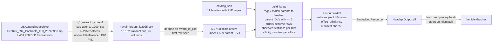

# Vehicle Knowledge Base: Schema and Build Pipeline (DELIV-950, reopened)

This document satisfies the narrowly reopened DELIV-950 (SEMP §2.1.4; CDRL
item A009): the schema of the vehicle knowledge base and the extract-
transform-load pipeline that builds it. No database is used. The knowledge
base is a versioned, hashed set of text files built offline, committed under
`src/Naadap.Output/Resources/kb/`, embedded in the `Naadap.Output` assembly,
and verified against its manifest before any run reads it.

| Item | Value |
| --- | --- |
| Current version | The `kb_version` file (format `yyyy-MM-dd.n`) |
| Build script | `scripts/kb/build_kb.py` (Python 3, standard library; deterministic; byte-reproducible on the same inputs) |
| Curated input | `scripts/kb/catalog.json`: vehicle families, each with a PIID regex, curated attributes, and source identifiers |
| Data input | `docs/research/g1-fpds/navair_orders_fy2025.csv`: every FY2025 transaction by the six NAVAIR contracting offices with a Referenced IDV PIID, extracted from the USAspending DoD archive by `docs/research/g1-fpds/g1_extract.py` |
| Consumer | `Naadap.Output.VehicleKnowledgeBase` (load and verify) and `Naadap.Output.VehicleMatcher` (match) |
| Governing design | `docs/design/vehicle-recommendation-pipeline.md`; derived requirements KB-600, KB-610, KB-620, KB-630, CORE-270 to CORE-275 (pending vetting at gate G3) |

## Files

| File | Format | Records | Content |
| --- | --- | --- | --- |
| `kb_version` | text, one line | 1 | Version string. Its date is the deterministic "as of" date for ordering-period checks. |
| `sources.jsonl` | JSON Lines | one per source | Provenance sources: `source_id`, `title`, `url` or `path`, `retrieved`, `sha256` (computed at build for repository files; recorded for the archive). |
| `families.jsonl` | JSON Lines | one per family | `family_id`, `name`, `piid_regex`, `member_piids_fy2025`, `orders_fy2025`, `source_ids`. |
| `vehicles.jsonl` | JSON Lines | one per row | The vehicle records (schema below). Families first in catalog order, then parent IDVs by descending FY2025 order count, then PIID. |
| `office_affinity.tsv` | TSV | one per (vehicle, office) | `vehicle_id`, `office_code`, `orders`, `share_of_office_orders`. Sorted by office, then orders descending, then vehicle id. |
| `manifest.sha256` | text | one per hashed file | `<sha256>  <filename>` for every file above. |
| `README.md` | Markdown | — | Summary and coverage figure. Not hashed. |

## Vehicle record

Keys are sorted alphabetically in the file; they are grouped here by meaning.

| Field | Type | Meaning | Source for family rows | Source for parent-IDV rows |
| --- | --- | --- | --- | --- |
| `vehicle_id` | string | Row identifier. A family id (`SEAPORT-NXG`) or a hyphen-stripped parent IDV PIID (`N0042122D0099`). | catalog | FPDS |
| `family` | string | Family identifier; equals `vehicle_id` for parent-IDV rows. | catalog | FPDS |
| `row_kind` | `family` or `parent-idv` | Whether the row aggregates every IDV matching a regex, or is one IDV. | — | — |
| `name` | string | Vehicle name. | catalog | Most frequent base award description |
| `vehicle_type` | string | MAC IDIQ, single-award IDIQ, BPA, BOA, FSS, GWAC. | catalog | Inferred from PIID character 9 (D, A, G) |
| `owner_office` | string | Procuring contracting office DoDAAC or agency code. | catalog | First six characters of the PIID |
| `owner_name` | string | Office name. | catalog | NAVAIR office table, else `unknown` |
| `scope_text` | string | The vehicle's scope in its own words. | catalog | Up to six distinct base award descriptions, joined by ` \| ` |
| `observed_descriptions` | string[] | Distinct FPDS base award descriptions, most frequent first, up to six. | FPDS | FPDS |
| `dod_programs` | string[] | Distinct `dod_acquisition_program_description` values, up to five. | FPDS | FPDS |
| `ordering_period_end` | ISO date, `evergreen`, or `unknown` | Last date to order. | catalog | **Proxy**: latest period-of-performance end among FY2025 orders; flagged in provenance and not used to eliminate |
| `ceiling_usd` | number, `none`, or `unknown` | Contract ceiling. | catalog | `unknown` |
| `eligible_ordering_activities` | string[] | Who may order. | catalog (prose) | Office codes observed ordering in FY2025 |
| `socioeconomic_pools` | string[] | Set-aside structure. | catalog | Set-aside codes observed on orders |
| `fee` | string | Access or funding fee. | catalog | `none` |
| `acquisition_path_tier` | 1–5 | CORE-273 taxonomy: 1 existing in-scope agency MAC/IDIQ; 2 FSS/MAS order or BPA call; 3 GWAC or other-agency vehicle; 4 new IDIQ; 5 new stand-alone contract (a BOA order is treated as 5). | catalog | Inferred from owner office and PIID type |
| `base_piids` | string[] | Member IDV PIIDs. | FPDS | the PIID |
| `orders_fy2025` | int | Distinct FY2025 NAVAIR orders under the row. | FPDS | FPDS |
| `ordering_offices_fy2025` | {office_code, orders}[] | Orders by contracting office. | FPDS | FPDS |
| `psc_set`, `naics_set` | {code, orders}[] | Top ten product service codes and NAICS codes on orders. | FPDS | FPDS |
| `set_aside_mix` | {code, orders}[] | Set-aside codes on orders (`NONE` when blank). | FPDS | FPDS |
| `small_business_share` | 0–1 | Share of orders whose contractor was determined small. | FPDS | FPDS |
| `services_share` | 0–1 | Share of orders with a letter-prefixed (services) PSC. | FPDS | FPDS |
| `latest_order_pop_end` | ISO date | Latest period-of-performance end among orders. | FPDS | FPDS |
| `obligations_fy2025_usd` | number | Sum of `federal_action_obligation` over the first transaction seen per order. Understates multi-modification orders. | FPDS | FPDS |
| `provenance` | object | `default` provenance (source ids, retrieval date, note) applying to every field, and `overrides` naming the fields whose provenance differs, including every proxy and every literal. Satisfies KB-620 with one triple per field by reference. | — | — |

Literals: `unknown` marks a value the sources do not supply; `none` marks a
value the source states as absent (no fee, no ceiling); `evergreen` marks an
ordering period with no end. Nothing is inferred into a field that carries a
literal, and every inference (vehicle type, tier) is named in `provenance.overrides`.

## Extract-transform-load

Extraction takes about two minutes for the FY2025 archive (streamed, not
extracted to disk); the build takes seconds. Both are re-run from scratch
for every knowledge-base version; nothing is edited by hand after the build.
Re-running the build on unchanged inputs reproduces every file byte-for-byte.

## Coverage and limits

| Measure | Value at version 2026-09-17.1 |
| --- | --- |
| Rows | 484 (11 families, 473 parent IDVs) |
| FY2025 NAVAIR orders under vehicles accounted for | 5,919 of 6,778 (87.3%); TPM target ≥ 80% (SEMP Table 3.2-1) |
| Orders under parents with fewer than three FY2025 orders, not represented | 859 (12.7%) |
| Fiscal years | FY2025 only. Ordering-period ends, ceilings, and multi-year affinity need FY2022 to FY2025 (Increment 2). |
| Scope | NAVAIR's six contracting offices. Vehicles used only by other Navy commands (NAVFAC construction and remediation vehicles, NAVSEA and NAVWAR vehicles other than SeaPort-NxG) are not rows, so the reference-20 fixture's NAVFAC ground-truth vehicles cannot be matched by name. Widening the extract to all DON offices is a one-flag change to `g1_extract.py` and is an Increment 2 decision. |
| Last-date-to-order for parent IDVs | Not retrieved; the proxy is flagged and not used to eliminate. Increment 2 pulls it from the USAspending IDV endpoint. |

## Versioning and integrity

- A new version is a new `kb_version` string, a full rebuild, and a new
  `manifest.sha256`. The change is Class I under SEMP §3.2.10 (frozen artifact).
- Every run manifest records `knowledgeBaseVersion` and
  `knowledgeBaseManifestSha256` (CORE-275).
- `VehicleKnowledgeBase.Load()` recomputes every hash in `manifest.sha256`
  from the embedded bytes before parsing. On mismatch it throws, the CLI
  prints the file name, exits with code 2, and writes no candidate list (KB-630).
