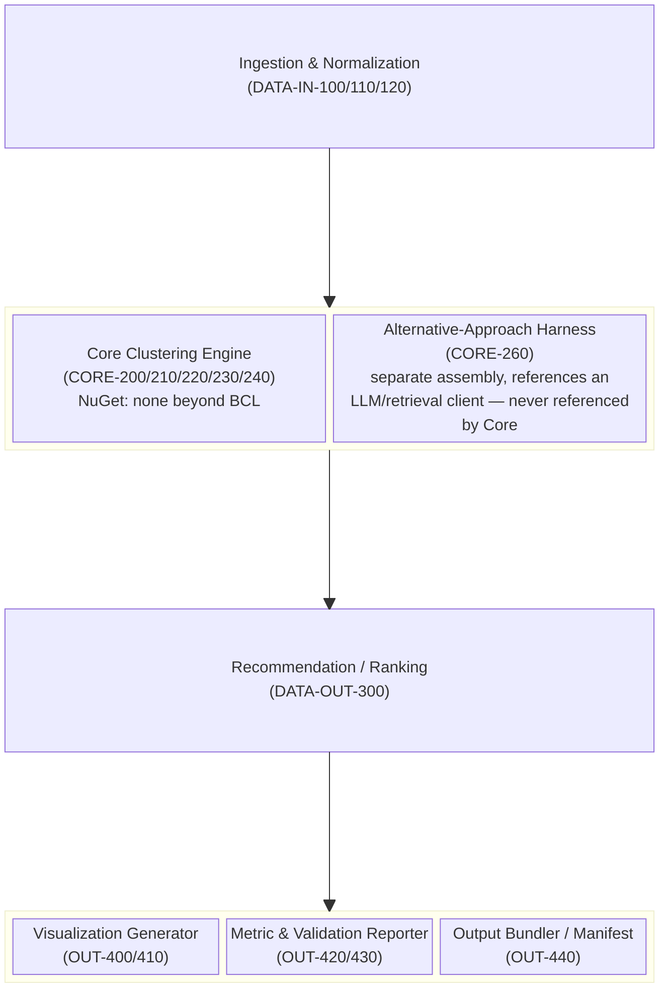
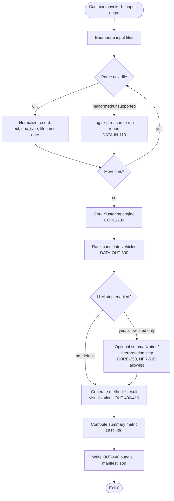

# Software Design Document (SDD)

<!--
Owned by the Systems Engineer, refined with the Software Engineer.
Describes the system architecture and the build/toolchain
conventions the codebase follows.
-->

## Architecture

### Overview

NAADAP is a **single-process, single-container batch pipeline**, not a
service or a distributed system. One `dotnet` executable, invoked once
per run (UI-001), reads an input document directory, runs entirely
in-memory/on-local-disk, and writes an output bundle (OUT-440) to an
output directory. There is no long-running server, no network peer,
and (per the Data Architecture decision below) no database — so most
of the multi-component MBSE machinery in systems-engineer.md's menu
does not earn its place here. What follows is the subset that does.

### Why no use case diagram / ICD

Confirmed reading of SN-5/Scope: this is a batch analysis + report
deliverable, not an interactive application. There is exactly one
actor with one interaction shape — an operator (human or CI job)
invokes the container with an input/output path pair and later reads
the output bundle from disk (UI-001). There is no second actor with a
meaningfully different interaction to justify a use case diagram, and
no live API/config surface for a separate team to build against — so
the ICD trigger in systems-engineer.md ("stops being optional the
moment the project has a UI") does not apply. **The implication for
the Implementation Plan: no `agent:ui-designer` track is created.**
The input document format and the OUT-440 output bundle layout are
still a real contract (SN-5, DELIV-930/940) — they're specified under
Build & Toolchain Conventions and Data Architecture below instead of
in a standalone ICD, since there's only one consumer (a human/CI
reviewer reading files) rather than a second system to build against.

### Block definition diagram — pipeline components

The RTVM's functional-area breakdown (DATA-IN / CORE / DATA-OUT / OUT)
maps to components, but the internal shape of CORE and OUT is not
obvious from the RTVM alone — in particular, CORE-240's inspection
requirement (zero LLM references in the core path) only works if the
core clustering engine and the alternative-comparison harness
(CORE-260) are physically separate assemblies, not a shared module
gated by a flag. That separation is a real architectural decision,
recorded here:

`Core` and `Alt` are separate .csproj projects. `Alt` may depend on an
LLM/HTTP client library; `Core` and every project it references must
not — this makes CORE-240's inspection (TP-240) a one-command
dependency-graph check (`dotnet list <Core.csproj> reference` /
package manifest diff) rather than a manual code read. The optional
LLM summarization/interpretation step (CORE-250) also lives in its own
project for the same reason, invoked only after `Recommend`, gated
behind an explicit config flag, never on the `Core` path.

### Activity diagram — pipeline run

Captures the branch points that prose left ambiguous: per-file error
handling (DATA-IN-110) and the optional LLM step (CORE-250) both
branch without aborting the run.

The Alternative-Approach Harness (CORE-260) is **not** a node in this
diagram — it is a separate, offline analysis run (executed during
development/validation against the same N=20 reference set, not
during a production invocation) whose output feeds the algorithm
documentation (DELIV-970), not the OUT-440 bundle. Keeping it off the
production activity path is itself part of satisfying CORE-240/260:
the rejected alternative never executes as part of a real run.

## Coding Standards

<!-- Established here as a starting default; refined with the
     Software Engineer during the Generate Code Base issue once real
     code exists to conform the standard to. -->

- **Language/style:** standard .NET naming conventions (PascalCase for
  types/methods/public members, camelCase for locals/private fields,
  `I`-prefixed interfaces). `dotnet format` enforced in CI once CI/CD
  exists; no separate style-linter dependency.
- **Solution layout** (also satisfies DELIV-910's plain-`net9.0`
  requirement and the assembly separation above):
  - `Naadap.sln`
  - `src/Naadap.Ingestion/` — DATA-IN-1xx
  - `src/Naadap.Core/` — CORE-2xx clustering engine; **zero**
    third-party/LLM dependencies (CORE-240)
  - `src/Naadap.Alternative/` — CORE-260 comparison harness only;
    never referenced by `Naadap.Core` or `Naadap.Cli`
  - `src/Naadap.LlmStep/` — optional CORE-250 summarization step;
    referenced by the CLI only, gated behind config
  - `src/Naadap.Output/` — DATA-OUT-3xx, OUT-4xx (ranking, viz,
    metrics, bundler)
  - `src/Naadap.Cli/` — UI-001 entrypoint; composes the above
  - `tests/Naadap.*.Tests/` — one test project per `src` project,
    mirroring TP-1xx/2xx/3xx/4xx
  - All projects target plain `net9.0` (DELIV-910) — no
    `net9.0-windows`, WPF, or WinForms anywhere in `src/`.
- **Data schema (in-memory contracts, not a DB schema — see Data
  Architecture):**
  - `DocumentRecord { string SourceFilename; DocType DocType; string
    ExtractedText; DateOnly? Date; }` — DATA-IN-100's normalized
    record.
  - `CandidateVehicle { string VehicleId; double Score; IReadOnlyList
    <string> ContributingDocuments; }` — DATA-OUT-300.
  - `RunManifest { IReadOnlyList<CandidateVehicle> Candidates; string
    MethodVisualizationPath; string ResultVisualizationPath; Metric
    SummaryMetric; string ValidationMethodologyPath; IReadOnlyList
    <SkippedFile> SkippedFiles; }` — OUT-440's manifest.json shape.
  - Every new document type or clustering component (DATA-IN-120)
    implements a documented extension interface (`IDocumentParser`,
    `IClusteringComponent`) rather than being special-cased in
    dispatch logic — walked through concretely in DELIV-940.
- **Dependency policy (DELIV-920):** every `<PackageReference>` beyond
  the .NET 9 BCL requires an inline `<!-- Justification: ... -->`
  comment in the `.csproj` next to it. Expected minimal set: a PDF/DOCX
  text-extraction library (Ingestion only) and, only in
  `Naadap.LlmStep`, an HTTP client for the USN-approved model
  allowlist. `Naadap.Core` should need none beyond the BCL.

## Build & Toolchain Conventions

This section is where `docs/PROJECT_DEFINITION.md`'s Deliverable
Requirements (DELIV-9xx) actually get satisfied — carried forward
verbatim from the RTVM issue handoff, now with the decisions this
issue was asked to make.

- **Toolchain:** `dotnet build` / `dotnet test` over `.csproj`/`.sln`
  only. No CMake, no other build system, anywhere in this repo
  (DELIV-900).
- **Target framework:** plain `net9.0` for every project under `src/`
  and `tests/` — no `net9.0-windows`, WPF, or WinForms (DELIV-910).
  This is what makes the Visual Studio deliverable a non-event: the
  `.sln`/`.csproj` generated by `dotnet new` on Ubuntu is byte-for-byte
  the same file Visual Studio on Windows opens.
- **Packaging:** single Docker image (multi-stage build: SDK image to
  `dotnet build`/`publish`, runtime image to run), all dependencies
  bundled at build time — no package restore at container run time
  (NFR-500).
- **Dependency policy:** minimal NuGet usage, every reference
  justified in the `.csproj` (DELIV-920) — see Coding Standards.

### Target-platform verification: decision (explicit, per systems-engineer.md)

**Decision: Windows/Visual Studio verification does NOT gate
individual features. It happens once, at a consolidation phase near
the end of the Implementation Plan, immediately before the
2026-09-22 submission.** Every feature issue through the Implementation
Plan is built and verified with `dotnet build`/`dotnet test` on this
pipeline's native Ubuntu environment; TP-910 (open `.sln` in Visual
Studio / build on a Windows runner) runs exactly once, in a
consolidation issue, not per `[RTVM-014]`-style feature.

**Rationale:**
- `docs/PROJECT_DEFINITION.md` already states this directly: "The
  Visual Studio deliverable is a packaging step, not a port... Systems
  Engineer should not budget schedule for a 'convert to VS' phase."
  Treating it as a per-feature gate would reintroduce exactly the
  phase the client said doesn't exist.
- The actual runtime target (SN-3) is Linux/Docker in an IL4 cloud —
  Windows/VS is a maintainability deliverable (SN-4) for HoloSim's own
  engineers, not the execution environment. Gating every feature on it
  would add a second execution environment's setup/permissions
  overhead to every one of ~15 feature issues, to protect against a
  risk (a Windows-only API sneaking in) that DELIV-910's own
  constraint — plain `net9.0`, no WPF/WinForms — already prevents
  structurally, by forbidding the APIs that would break Windows
  portability in the first place.
- One consolidation-phase check (TP-910) catches anything the
  structural constraint missed, at a fraction of the cost of N checks.

## Data Architecture

### Decision: no database (resolves DATA-OUT-310 / DELIV-950)

**No database is used anywhere in this system.** All run output is
file-based: the OUT-440 bundle is a directory containing
`manifest.json` (the `RunManifest` shape above), the candidate list,
both visualization artifacts, the metric report, and a pointer to the
validation-methodology document — all written once per run and
re-readable indefinitely afterward without re-executing the pipeline,
which is what <a href="https://github.com/HoloSim-Interactive/NAADAP/blob/main/docs/RTVM.md#rtvm-data-out-310" target="_blank">DATA-OUT-310</a> actually asked for. A flat manifest gives
the same "re-readable/auditable without re-running" property a
database would, at zero added runtime dependency, zero added attack
surface for the IL4 boundary (NFR-500/510), and zero schema-migration
concern for a system whose real *replicability* need (<a href="#sdd-nfr-520-replicability">NFR-520, below</a>)
is about stateless repeatability, not concurrent shared storage.

**Consequence for the RTVM:** <a href="https://github.com/HoloSim-Interactive/NAADAP/blob/main/docs/RTVM.md#rtvm-data-out-310" target="_blank">DATA-OUT-310</a> and <a href="https://github.com/HoloSim-Interactive/NAADAP/blob/main/docs/RTVM.md#rtvm-deliv-950" target="_blank">DELIV-950</a> are withdrawn
(both were Draft, conditional on "if a database is used" — see RTVM
update below). <a href="https://github.com/HoloSim-Interactive/NAADAP/blob/main/docs/RTVM.md#rtvm-out-440" target="_blank">OUT-440</a> is the item that actually satisfies the
"result set is re-readable/auditable" need going forward.

### Run-scoped data flow (single process, no network)

Everything below happens inside one process, in this order, with each
stage's output the next stage's input — no shared mutable state, no
inter-process messaging, nothing to lose ordering guarantees over:

`input dir (files)` → `Ingestion (List<DocumentRecord>, in-memory)` →
`Core (cluster assignments, in-memory)` → `Output.Recommend
(List<CandidateVehicle>, in-memory)` → `Output.Bundler (writes
manifest.json + artifacts to output dir, on disk, final)`.

### NFR-520 — horizontal replicability: resolved

**Resolution: interpretation (b) — independent, fully stateless
full-replica runs, not (a) sharded partitioning of one logical run.**

Reasoning, recorded here since Solutions Architect's input was
requested on this in the RTVM issue and this is the deciding
rationale (flagged to Solutions Architect for review — see
hand-off comment; this SDD proceeds on this basis rather than leaving
NFR-520 blocking):

- Scope already rules out (a): "Horizontal multi-container
  replicability as a day-one feature" is explicitly out of MVP scope,
  and CORE-220's 30-minute runtime target is already met on the
  *lowest* resource tier (1c/2GB) per SN-1/SN-2 — there is no
  performance problem sharding would solve. SN-2's actual ask is a
  compute-footprint/robustness score, not throughput scaling.
- The system already has zero shared mutable state by construction
  (see data flow above: everything is in-memory per-process, and the
  only durable artifact is a final, once-written output directory) —
  so (b) costs nothing extra to satisfy. Running N independent copies
  of the same container against the same input directory (each
  writing to its own output directory) trivially reproduces CORE-210's
  existing ≥95% reproducibility guarantee per replica, with no
  coordination, locking, or partitioning logic required.
- Consequence: NFR-520 is architecturally a corollary of CORE-210
  (determinism) plus "no shared state," not a separate mechanism to
  build. There is no NFR-520-specific code — TP-520 becomes "run
  CORE-210's existing test procedure concurrently across N container
  instances against the same input, confirm each instance
  independently reproduces the same top-5 list ≥95% of the time."

**RTVM update:** NFR-520 moves Draft → Approved; TP-520 is written
below (see RTVM.md diff). If Solutions Architect disagrees with this
reading once reviewed, it can be revisited before implementation
starts — the requirement/test procedure text makes the sharded
alternative (a) easy to distinguish and swap in if so.

## SETR Documentation Mapping (DELIV-960)

Per <a href="https://github.com/HoloSim-Interactive/NAADAP/blob/main/docs/RTVM.md#rtvm-deliv-960" target="_blank">DELIV-960</a>, reconciling the verified NAVAIR Instruction 4355.19D
review sequence (see <a href="https://github.com/HoloSim-Interactive/NAADAP/blob/main/docs/RTVM.md" target="_blank">docs/RTVM.md</a> Research notes and this role's
memory) against this project's own pipeline artifacts. Only reviews
plausibly reachable before the 2026-09-22 Submissions Deadline are
mapped in detail; later-lifecycle reviews (production/in-service) are
noted as out of reach for a prize-challenge Phase 2 submission and are
not blocking.

| SETR Review/Artifact | Nature | NAADAP equivalent | Reachable by 2026-09-22? |
| --- | --- | --- | --- |
| Initial Technical Review (ITR) | Event | `docs/PROJECT_DEFINITION.md` creation/confirmation (issue #1→#2 handoff) | Yes — already occurred |
| Alternative Systems Review (ASR) | Event | CORE-260's alternative-approach comparison (the "why not LLM-first" analysis) doubles as this — it's the point where a competing approach is evaluated and rejected | Yes — scheduled as part of CORE-260's implementation |
| System Requirements Review (SRR) | Event, backed by a document | RTVM approval (issue #2 close) — `docs/RTVM.md` is the artifact reviewed | Yes — already occurred |
| System Functional Review (SFR) | Event, backed by a document | This SDD's Architecture section (functional decomposition into Ingestion/Core/Output) | Yes — this issue |
| Preliminary Design Review (PDR) | **Document**, per this project's convention | `docs/SDD.md` in its current (architecture-defined, not yet implementation-complete) state | Yes — this issue produces it |
| Critical Design Review (CDR) | **Document**, per this project's convention | `docs/SDD.md` + `docs/IMPLEMENTATION_PLAN.md` together, once the Implementation Plan issue finalizes build sequencing and coding standards are locked | Yes — Implementation Plan issue |
| Test Readiness Review (TRR) | Event | Each `[RTVM-014]`-style feature issue's hand-off from Software Engineer to Test Engineer (`status:ready-for-test`) | Yes — ongoing, per-feature |
| System Verification Review (SVR) | Event | Final regression pass across the full RTVM before submission packaging (consolidation phase, alongside TP-910) | Yes — planned in Implementation Plan |
| Production Readiness Review (PRR) | Event | Docker image build/packaging verification (DELIV-900/910/920 inspection pass) | Yes — consolidation phase |
| Physical Configuration Audit (PCA) | Event | Final clean-clone build check against the submitted package (TP-900/930) | Yes — consolidation phase |
| Technology Readiness Assessment (TRA), Integrated Baseline Review (IBR), In-Service Review (ISR) | Events | No equivalent produced — these presuppose a funded program of record / fielded system, not a prize-challenge Phase 2 submission | No — out of reach and not applicable; not a gap, a scope boundary |

**"PEDDAL"** remains unresolved (see <a href="https://github.com/HoloSim-Interactive/NAADAP/blob/main/docs/RTVM.md#rtvm-research-notes" target="_blank">RTVM Research notes</a> and this role's memory) — not
mapped above, pending Product Manager's answer. Nothing here is
blocked on it: <a href="https://github.com/HoloSim-Interactive/NAADAP/blob/main/docs/RTVM.md#rtvm-deliv-960" target="_blank">DELIV-960</a>'s test procedure (<a href="https://github.com/HoloSim-Interactive/NAADAP/blob/main/docs/RTVM.md#rtvm-tp-960" target="_blank">TP-960</a>) only requires this
mapping table to exist for the reviews that are reachable, which it
now does.
