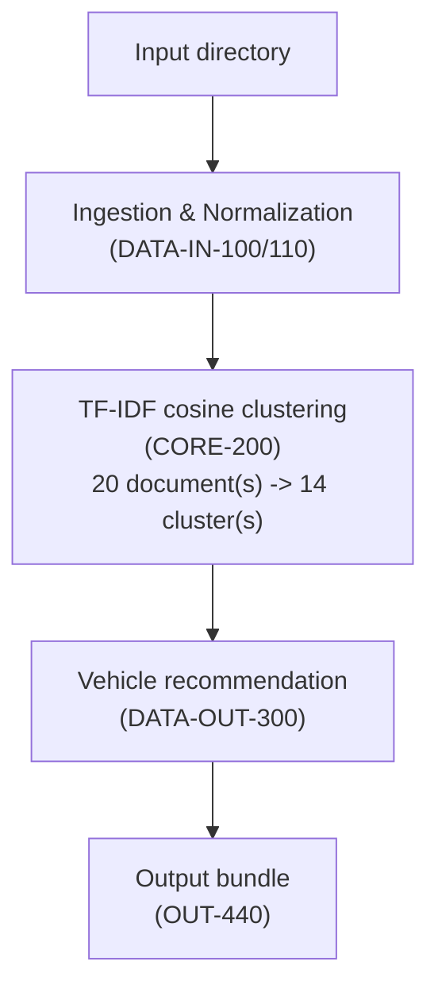

# Analysis Method (OUT-400)

This run ingested **20** document(s) and skipped **1**, then grouped the ingested documents into **14** cluster(s) using TF-IDF cosine-similarity clustering (CORE-200), with a similarity threshold of **0.35** (see `Naadap.Core.TfIdfCosineClusteringComponent` for the threshold's derivation).

## Clusters formed this run

| Cluster | Documents | Top terms |
| --- | --- | --- |
| cluster-0001 | 1 | calibration, dsc, pmv, maintenance, thermal |
| cluster-0002 | 3 | item, group, specify, estimated, enter |
| cluster-0003 | 1 | jira, swrmc, marmc, nswc, dalgren |
| cluster-0004 | 4 | contract, niris, experience, order, information |
| cluster-0005 | 1 | rfi, ips, power, integrated, information |
| cluster-0006 | 1 | please, sampling, confirm, annual, monthly |
| cluster-0007 | 1 | flooring, surfaces, paint, area, project |
| cluster-0008 | 1 | square, asphalt, pavement, parking, speci |
| cluster-0009 | 1 | wage, operator, rate, power, equipment |
| cluster-0010 | 1 | cord, reel, disconnect, electrical, equipment |
| cluster-0011 | 1 | pump, fire, inspection, diesel, water |
| cluster-0012 | 1 | height, lifting, yokosuka, imf, mast |
| cluster-0013 | 1 | controllers, siemens, brand, standardization, frcs |
| cluster-0014 | 2 | escrow, real, contract, evidence, closing |
