# Results (OUT-410)

**14** candidate vehicle(s) recommended this run, ranked by score (cluster cohesion — see DATA-OUT-300 in docs/SDD.md).

| Rank | Candidate Vehicle | Score | Contributing Documents |
| --- | --- | --- | --- |
| 1 | CLUSTER-0002-ITEM-GROUP-SPECIFY | 0.959 | v1-02-nswccd-cdrl-a001-inspection.pdf, v1-03-nswccd-cdrl-a002-calibration.pdf, v1-05-fusionsupport-cdrl.pdf |
| 2 | CLUSTER-0014-ESCROW-REAL-CONTRACT | 0.400 | v4-01-title-escrow-sow.pdf, v4-02-title-escrow-solicitation.pdf |
| 3 | CLUSTER-0004-CONTRACT-NIRIS-EXPERIENCE | 0.314 | v1-06-advanced-power-sow.docx, v2-01-sbrac-vi-solicitation.pdf, v2-02-ev35-biosparge-sow.pdf, v3-06-firepumps-r38-solicitation.pdf |
| 4 | CLUSTER-0001-CALIBRATION-DSC-PMV | 0.000 | v1-01-nswccd-pws.pdf |
| 5 | CLUSTER-0003-JIRA-SWRMC-MARMC | 0.000 | v1-04-fusionsupport-sow.pdf |
| 6 | CLUSTER-0005-RFI-IPS-POWER | 0.000 | v1-07-advanced-power-followon-rfi.docx |
| 7 | CLUSTER-0006-PLEASE-SAMPLING-CONFIRM | 0.000 | v2-03-ev35-ppi-log02.pdf |
| 8 | CLUSTER-0007-FLOORING-SURFACES-PAINT | 0.000 | v3-01-beq-m400-paintflooring-sow.pdf |
| 9 | CLUSTER-0008-SQUARE-ASPHALT-PAVEMENT | 0.000 | v3-02-parkinglot-repairs-sow.pdf |
| 10 | CLUSTER-0009-WAGE-OPERATOR-RATE | 0.000 | v3-03-parkinglot-repairs-rfp.pdf |
| 11 | CLUSTER-0010-CORD-REEL-DISCONNECT | 0.000 | v3-04-as4108-oilfiltration-sow.pdf |
| 12 | CLUSTER-0011-PUMP-FIRE-INSPECTION | 0.000 | v3-05-firepumps-r38-sow.pdf |
| 13 | CLUSTER-0012-HEIGHT-LIFTING-YOKOSUKA | 0.000 | v3-07-forklift-lease-sow.pdf |
| 14 | CLUSTER-0013-CONTROLLERS-SIEMENS-BRAND | 0.000 | v3-08-rot-frcs-sources-sought.pdf |

```mermaid
flowchart LR
    V1["#1 CLUSTER-0002-ITEM-GROUP-SPECIFY\nscore 0.959"]
    V1_v1_02_nswccd_cdrl_a001_inspection_pdf["v1-02-nswccd-cdrl-a001-inspection.pdf"] --> V1
    V1_v1_03_nswccd_cdrl_a002_calibration_pdf["v1-03-nswccd-cdrl-a002-calibration.pdf"] --> V1
    V1_v1_05_fusionsupport_cdrl_pdf["v1-05-fusionsupport-cdrl.pdf"] --> V1
    V2["#2 CLUSTER-0014-ESCROW-REAL-CONTRACT\nscore 0.400"]
    V2_v4_01_title_escrow_sow_pdf["v4-01-title-escrow-sow.pdf"] --> V2
    V2_v4_02_title_escrow_solicitation_pdf["v4-02-title-escrow-solicitation.pdf"] --> V2
    V3["#3 CLUSTER-0004-CONTRACT-NIRIS-EXPERIENCE\nscore 0.314"]
    V3_v1_06_advanced_power_sow_docx["v1-06-advanced-power-sow.docx"] --> V3
    V3_v2_01_sbrac_vi_solicitation_pdf["v2-01-sbrac-vi-solicitation.pdf"] --> V3
    V3_v2_02_ev35_biosparge_sow_pdf["v2-02-ev35-biosparge-sow.pdf"] --> V3
    V3_v3_06_firepumps_r38_solicitation_pdf["v3-06-firepumps-r38-solicitation.pdf"] --> V3
    V4["#4 CLUSTER-0001-CALIBRATION-DSC-PMV\nscore 0.000"]
    V4_v1_01_nswccd_pws_pdf["v1-01-nswccd-pws.pdf"] --> V4
    V5["#5 CLUSTER-0003-JIRA-SWRMC-MARMC\nscore 0.000"]
    V5_v1_04_fusionsupport_sow_pdf["v1-04-fusionsupport-sow.pdf"] --> V5
    V6["#6 CLUSTER-0005-RFI-IPS-POWER\nscore 0.000"]
    V6_v1_07_advanced_power_followon_rfi_docx["v1-07-advanced-power-followon-rfi.docx"] --> V6
    V7["#7 CLUSTER-0006-PLEASE-SAMPLING-CONFIRM\nscore 0.000"]
    V7_v2_03_ev35_ppi_log02_pdf["v2-03-ev35-ppi-log02.pdf"] --> V7
    V8["#8 CLUSTER-0007-FLOORING-SURFACES-PAINT\nscore 0.000"]
    V8_v3_01_beq_m400_paintflooring_sow_pdf["v3-01-beq-m400-paintflooring-sow.pdf"] --> V8
    V9["#9 CLUSTER-0008-SQUARE-ASPHALT-PAVEMENT\nscore 0.000"]
    V9_v3_02_parkinglot_repairs_sow_pdf["v3-02-parkinglot-repairs-sow.pdf"] --> V9
    V10["#10 CLUSTER-0009-WAGE-OPERATOR-RATE\nscore 0.000"]
    V10_v3_03_parkinglot_repairs_rfp_pdf["v3-03-parkinglot-repairs-rfp.pdf"] --> V10
    V11["#11 CLUSTER-0010-CORD-REEL-DISCONNECT\nscore 0.000"]
    V11_v3_04_as4108_oilfiltration_sow_pdf["v3-04-as4108-oilfiltration-sow.pdf"] --> V11
    V12["#12 CLUSTER-0011-PUMP-FIRE-INSPECTION\nscore 0.000"]
    V12_v3_05_firepumps_r38_sow_pdf["v3-05-firepumps-r38-sow.pdf"] --> V12
    V13["#13 CLUSTER-0012-HEIGHT-LIFTING-YOKOSUKA\nscore 0.000"]
    V13_v3_07_forklift_lease_sow_pdf["v3-07-forklift-lease-sow.pdf"] --> V13
    V14["#14 CLUSTER-0013-CONTROLLERS-SIEMENS-BRAND\nscore 0.000"]
    V14_v3_08_rot_frcs_sources_sought_pdf["v3-08-rot-frcs-sources-sought.pdf"] --> V14
```

## Strategic-vehicle candidates per cluster

Candidates are knowledge-base vehicles that survived every evaluable hard constraint, scored as 0.6 × lexical scope overlap + 0.4 × office affinity, ranked with the acquisition-path tier deciding near-ties (within 0.05). Evidence floor 0.05. The complete ranking, including every eliminated vehicle, is in `vehicle-ranking.tsv`. Selection is reserved to the contracting officer and the FAR 7.107 / NMCARS 5237.102 approval authorities.

### cluster-0001

Requesting office(s) found in the documents: none

| Rank | Vehicle | Family | Tier | Score | Lexical | Affinity (office, share) | Matched terms | Deciding key |
| --- | --- | --- | --- | --- | --- | --- | --- | --- |
| 1 | N6833523D0003 | N6833523D0003 | 1 | 0.129 | 0.215 | — | calibration contract delivery | score |
| 2 | N6893620D0015 | N6893620D0015 | 1 | 0.101 | 0.169 | — | calibration maintenance thermal traceable equipment one calibrations surface | score |
| 3 | N6893620D0016 | N6893620D0016 | 1 | 0.100 | 0.166 | — | calibration visit labor preventative point | score |
| 4 | N0042120D0010 | N0042120D0010 | 1 | 0.096 | 0.159 | — | maintenance | score |
| 5 | N6852020D0012 | N6852020D0012 | 1 | 0.095 | 0.158 | — | maintenance | score |

Below the evidence floor (458 in total; first 5 shown): N0042122D0094 (0.049); N0001924D0008 (0.048); N0001925D0012 (0.048); N0001922D0003 (0.047); N0042124D0005 (0.047)

### cluster-0002

Requesting office(s) found in the documents: none

| Rank | Vehicle | Family | Tier | Score | Lexical | Affinity (office, share) | Matched terms | Deciding key |
| --- | --- | --- | --- | --- | --- | --- | --- | --- |
| 1 | N6833520G3036 | N6833520G3036 | 5 | 0.137 | 0.229 | — | item configuration | score |
| 2 | N0001919D0005 | N0001919D0005 | 1 | 0.070 | 0.117 | — | item software contract line product operating testing delivery | score |
| 3 | N0001923D0018 | N0001923D0018 | 1 | 0.068 | 0.113 | — | item software contract report line system mission component | score |
| 4 | GSA-MAS | GSA-MAS | 2 | 0.056 | 0.093 | — | item use dfars subpart award supply part dod | tier |

Below the evidence floor (480 in total; first 5 shown): N6833520D0032 (0.038); N0001920D0023 (0.026); SEAPORT-NXG (0.024); N0042125D0303 (0.021); N0001920D0017 (0.021)

### cluster-0003

Requesting office(s) found in the documents: none

| Rank | Vehicle | Family | Tier | Score | Lexical | Affinity (office, share) | Matched terms | Deciding key |
| --- | --- | --- | --- | --- | --- | --- | --- | --- |
| 1 | N0042121D0010 | N0042121D0010 | 1 | 0.093 | 0.156 | — | integration project management design dod across system program | score |
| 2 | N6893619D0027 | N6893619D0027 | 1 | 0.079 | 0.132 | — | information management technology | score |
| 3 | N0001922D0008 | N0001922D0008 | 1 | 0.071 | 0.119 | — | security program joint | score |
| 4 | N6893618D0014 | N6893618D0014 | 1 | 0.058 | 0.097 | — | security cyber | score |
| 5 | SEAPORT-NXG | SEAPORT-NXG | 1 | 0.058 | 0.096 | — | management program technical integrated areas engineering contract department | score |

Below the evidence floor (478 in total; first 5 shown): N0042120D0007 (0.050); N0042120D0006 (0.048); N0042119D0024 (0.047); N6134021D0015 (0.047); N6893623D0023 (0.047)

### cluster-0004

Requesting office(s) found in the documents: N62742

| Rank | Vehicle | Family | Tier | Score | Lexical | Affinity (office, share) | Matched terms | Deciding key |
| --- | --- | --- | --- | --- | --- | --- | --- | --- |
| 1 | SEAPORT-NXG | SEAPORT-NXG | 1 | 0.089 | 0.148 | — | management contract engineering program areas systems technical equipment | score |
| 2 | NAWCTSD-TSC-IV | NAWCTSD-TSC-IV | 1 | 0.054 | 0.090 | — | contract system systems minimum part evaluation training development | score |
| 3 | GSA-MAS | GSA-MAS | 2 | 0.050 | 0.084 | — | far schedule federal use part dod commercial products | tier |
| 4 | NAVAIR-HQ-BOA | NAVAIR-HQ-BOA | 5 | 0.066 | 0.110 | — | contract equipment used engineering action orders agreements standard | tier |

Below the evidence floor (7 in total; first 5 shown): NAWCAD-SCI-MAC (0.050); NAWCTSD-FTSS-V (0.045); NAWCTSD-PACRM (0.045); NAWCAD-CYBER-IDIQ (0.024); DON-ESL-BPA (0.017)

Ruled out by hard constraint: OFFICE-NOT-AMONG-OBSERVED-ORDERING-ACTIVITIES × 473 (e.g. FA857619D0001: requesting office(s) N62742 not among FY2025 ordering activities N00421,N00019)

### cluster-0005

Requesting office(s) found in the documents: none

| Rank | Vehicle | Family | Tier | Score | Lexical | Affinity (office, share) | Matched terms | Deciding key |
| --- | --- | --- | --- | --- | --- | --- | --- | --- |
| 1 | N6893619D0027 | N6893619D0027 | 1 | 0.136 | 0.227 | — | information | score |
| 2 | N6833521D0048 | N6833521D0048 | 1 | 0.085 | 0.141 | — | power repair module new | score |
| 3 | N6893620D0007 | N6893620D0007 | 1 | 0.071 | 0.119 | — | information field technical engineering | score |
| 4 | N0001922D0003 | N0001922D0003 | 1 | 0.070 | 0.116 | — | power repair | score |
| 5 | N0001924D0126 | N0001924D0126 | 1 | 0.070 | 0.116 | — | power repair inspection | score |

Below the evidence floor (472 in total; first 5 shown): N6893622D0002 (0.049); N6893623D0014 (0.048); N6893623D0023 (0.048); N6134021D0015 (0.045); N0001923D0015 (0.042)

### cluster-0006

Requesting office(s) found in the documents: none

| Rank | Vehicle | Family | Tier | Score | Lexical | Affinity (office, share) | Matched terms | Deciding key |
| --- | --- | --- | --- | --- | --- | --- | --- | --- |
| 1 | N6833522D0012 | N6833522D0012 | 1 | 0.059 | 0.099 | — | annual | score |

Below the evidence floor (483 in total; first 5 shown): N6833521D0046 (0.046); N0001921D0004 (0.030); N6893623D0001 (0.030); N0042124D0006 (0.029); N0001923D0010 (0.028)

### cluster-0007

Requesting office(s) found in the documents: none

| Rank | Vehicle | Family | Tier | Score | Lexical | Affinity (office, share) | Matched terms | Deciding key |
| --- | --- | --- | --- | --- | --- | --- | --- | --- |
| 1 | N6893621D0011 | N6893621D0011 | 1 | 0.066 | 0.110 | — | furniture finishes equipment contract | score |

Below the evidence floor (483 in total; first 5 shown): N0042122D0101 (0.039); N0042120D0007 (0.039); N0042119D0055 (0.036); N0001925D0014 (0.034); N0042121D0010 (0.033)

### cluster-0008

Requesting office(s) found in the documents: none

| Rank | Vehicle | Family | Tier | Score | Lexical | Affinity (office, share) | Matched terms | Deciding key |
| --- | --- | --- | --- | --- | --- | --- | --- | --- |

Below the evidence floor (484 in total; first 5 shown): N0042118D0042 (0.043); N0042118D0044 (0.042); N0042119D0055 (0.041); N0042123D0007 (0.040); N0042119D0075 (0.037)

### cluster-0009

Requesting office(s) found in the documents: N40085

| Rank | Vehicle | Family | Tier | Score | Lexical | Affinity (office, share) | Matched terms | Deciding key |
| --- | --- | --- | --- | --- | --- | --- | --- | --- |

Below the evidence floor (11 in total; first 5 shown): NAWCAD-SCI-MAC (0.027); SEAPORT-NXG (0.022); NAWCAD-CYBER-IDIQ (0.012); NAWCTSD-FTSS-V (0.010); NAWCTSD-PACRM (0.010)

Ruled out by hard constraint: OFFICE-NOT-AMONG-OBSERVED-ORDERING-ACTIVITIES × 473 (e.g. FA857619D0001: requesting office(s) N40085 not among FY2025 ordering activities N00421,N00019)

### cluster-0010

Requesting office(s) found in the documents: none

| Rank | Vehicle | Family | Tier | Score | Lexical | Affinity (office, share) | Matched terms | Deciding key |
| --- | --- | --- | --- | --- | --- | --- | --- | --- |
| 1 | N0042122D0094 | N0042122D0094 | 1 | 0.056 | 0.094 | — | equipment space material | score |
| 2 | N0001918D0123 | N0001918D0123 | 1 | 0.050 | 0.084 | — | equipment test special | score |
| 3 | N6833515G0022 | N6833515G0022 | 5 | 0.060 | 0.100 | — | equipment plug test set | score |

Below the evidence floor (481 in total; first 5 shown): N6893621D0011 (0.048); N0001923D0001 (0.045); N6893621D0024 (0.042); N0042122D0099 (0.041); N6893622D0032 (0.039)

### cluster-0011

Requesting office(s) found in the documents: N62472

| Rank | Vehicle | Family | Tier | Score | Lexical | Affinity (office, share) | Matched terms | Deciding key |
| --- | --- | --- | --- | --- | --- | --- | --- | --- |

Below the evidence floor (11 in total; first 5 shown): NAWCTSD-TSC-IV (0.026); NAWCTSD-FTSS-V (0.020); NAWCTSD-PACRM (0.019); SEAPORT-NXG (0.017); NAWCAD-SCI-MAC (0.015)

Ruled out by hard constraint: OFFICE-NOT-AMONG-OBSERVED-ORDERING-ACTIVITIES × 473 (e.g. FA857619D0001: requesting office(s) N62472 not among FY2025 ordering activities N00421,N00019)

### cluster-0012

Requesting office(s) found in the documents: none

| Rank | Vehicle | Family | Tier | Score | Lexical | Affinity (office, share) | Matched terms | Deciding key |
| --- | --- | --- | --- | --- | --- | --- | --- | --- |
| 1 | N0042120D0010 | N0042120D0010 | 1 | 0.065 | 0.109 | — | maintenance material engineering | score |
| 2 | N6833521D0049 | N6833521D0049 | 1 | 0.056 | 0.093 | — | units electric power year two three delivery one | score |
| 3 | N6893621D0001 | N6893621D0001 | 1 | 0.051 | 0.085 | — | type delivery units repair | score |

Below the evidence floor (481 in total; first 5 shown): N0042123D0007 (0.050); N6134019D1006 (0.049); N0042120D0012 (0.049); N0001921D0004 (0.049); N6833524D0020 (0.046)

### cluster-0013

Requesting office(s) found in the documents: N68520

| Rank | Vehicle | Family | Tier | Score | Lexical | Affinity (office, share) | Matched terms | Deciding key |
| --- | --- | --- | --- | --- | --- | --- | --- | --- |
| 1 | N6852023D0001 | N6852023D0001 | 1 | 0.061 | 0.024 | N68520, 0.117 | labor engineering | score |
| 2 | NASA-SEWP | NASA-SEWP | 3 | 0.053 | 0.071 | N68520, 0.026 | equipment software associated solutions products hardware procurement order | tier |

Below the evidence floor (34 in total; first 5 shown): N6852023D0111 (0.047); SEAPORT-NXG (0.045); N6852021D0002 (0.041); NAWCTSD-PACRM (0.041); NAWCTSD-FTSS-V (0.036)

Ruled out by hard constraint: OFFICE-NOT-AMONG-OBSERVED-ORDERING-ACTIVITIES × 448 (e.g. FA857619D0001: requesting office(s) N68520 not among FY2025 ordering activities N00421,N00019)

### cluster-0014

Requesting office(s) found in the documents: N69450

**NEW-VEHICLE-INDICATED**: no knowledge-base vehicle reached the evidence floor for a cluster of two or more requirements.

| Rank | Vehicle | Family | Tier | Score | Lexical | Affinity (office, share) | Matched terms | Deciding key |
| --- | --- | --- | --- | --- | --- | --- | --- | --- |

Below the evidence floor (11 in total; first 5 shown): SEAPORT-NXG (0.033); NAWCTSD-FTSS-V (0.029); NAWCTSD-TSC-IV (0.026); NAWCAD-SCI-MAC (0.015); NAWCTSD-PACRM (0.013)

Ruled out by hard constraint: OFFICE-NOT-AMONG-OBSERVED-ORDERING-ACTIVITIES × 473 (e.g. FA857619D0001: requesting office(s) N69450 not among FY2025 ordering activities N00421,N00019)
