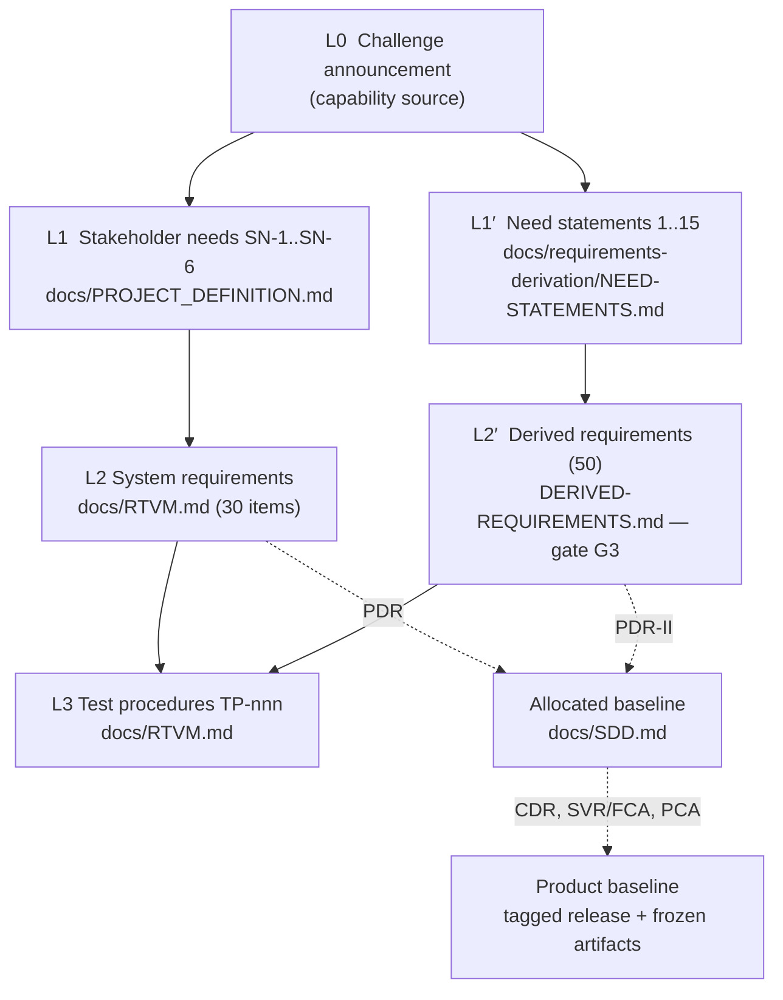

# Systems Engineering Management Plan (SEMP)

## NAADAP — Acquisition-Documentation Analysis and Contract-Vehicle Recommender

| Field | Value |
| --- | --- |
| Document identifier | NAADAP-SEMP-001 |
| Revision | Draft A.1 |
| Date | 2026-09-15 |
| Data Item Description | DI-SESS-81785B, Systems Engineering Management Plan (SEMP), approved 2025-01-08, AMSC 10515, project SESS-2024-043; supersedes DI-SESS-81785A. All three revisions (2009, A, B) are on file in `.claude/skills/gov-acquisition-sme/sources/`, downloaded from ASSIST 2026-09-15. The A-to-B delta is reconciled in §1.3. |
| Topic source | OSD Systems Engineering Plan (SEP) Outline, Version 4.1, May 2023 (DOPSR 23-S-1904), applied per DI-SESS-81785 §2: "In the absence of a government SEP, the SEMP shall address the topics in the OSD SEP Outline active at the time of the RFP." |
| Program | NAADAP prize-challenge entry (Phase 2 initial technical package; Phase 3 Demo Day) |
| Preparing organization | HoloSim Interactive |
| Sponsor | NAVAIR / NAWCAD, Procurement Group Innovation Lab (PGIL), via Tech Grove |
| Classification | UNCLASSIFIED |
| Distribution | Public repository content. No Government Furnished Information (GFI) is reproduced in this document. |
| Supersedes | The "SETR Documentation Mapping (DELIV-960)" table in `docs/SDD.md`, for the review sequence only (see §3.2.13). |

### Approval

The SEP Outline's approval page names Government positions. This is a contractor SEMP; the positions below are the contractor equivalents. A signature on the "Approved" line constitutes acceptance of this plan as the technical-management baseline for the program.

| Action | Position | Name | Signature | Date |
| --- | --- | --- | --- | --- |
| Prepared by | Systems Engineer | | | |
| Reviewed by | Solutions Architect | | | |
| Reviewed by | Product Manager | | | |
| Approved by | Principal, HoloSim Interactive (Program Manager) | | | |
| Concurrence (when applicable) | Government Lead Systems Engineer, PGIL / NAWCAD | | | |

### Revision history

| Revision | Date | Description | Author |
| --- | --- | --- | --- |
| Draft A | 2026-09-15 | Initial issue. Addresses SEP Outline 4.1 topics for Increments 1 and 2. | Systems Engineer |
| Draft A.1 | 2026-09-15 | Minor update per §1.6 item 5: DI-SESS-81785B reconciled (§1.3, §4, References). Issue I-2 closed. ESS recorded as not applicable (Table 3.2-4). | Systems Engineer |

### Contents

1. [Introduction](#1-introduction)
2. [Program Technical Definition](#2-program-technical-definition)
3. [Program Technical Management](#3-program-technical-management)
4. [DID Conformance Crosswalk](#4-did-conformance-crosswalk)
- [Appendix A — Acronyms](#appendix-a--acronyms)
- [Appendix B — Item Unique Identification Implementation Plan](#appendix-b--item-unique-identification-implementation-plan)
- [Appendix C — Agile and DevSecOps Software Development Metrics](#appendix-c--agile-and-devsecops-software-development-metrics)
- [Appendix D — Concept of Operations Description](#appendix-d--concept-of-operations-description)
- [Appendix E — Digital Engineering Implementation Plan](#appendix-e--digital-engineering-implementation-plan)
- [References](#references)

---

## 1 Introduction

### 1.1 Program summary

NAADAP is HoloSim Interactive's entry to a NAVAIR/NAWCAD prize challenge. The product is a batch software tool that reads a set of acquisition documents (statements of work, performance work statements, CDRLs, sources-sought notices, and open-source text) and returns, for each group of documents sharing a common requirement, a ranked list of candidate strategic contract vehicles capable of absorbing that requirement, with the evidence for each candidate and the reasons the other vehicles were ruled out. The tool identifies suitable vehicles; it does not select one. Selection is reserved to the contracting officer and the approval authorities named in FAR 7.107 and NMCARS 5237.102.

The program has two increments, decided by the Principal on 2026-09-15.

| Increment | Deliverable | Due | Data |
| --- | --- | --- | --- |
| Increment 1 (v1) | Phase 2 initial technical package: the twelve items listed in §3.1.1 | 2026-09-22 (worst case) or 2026-10-02 (see Risk R-2) | Public only: SAM.gov documents, the USAspending/FPDS bulk archive, a hand-curated then data-derived vehicle knowledge base |
| Increment 2 (v2) | Phase 3 Demo Day materials and the basis for a follow-on Other Transaction agreement | Materials 2026-11-12; Demo Day 2026-11-09 or 2026-11-19 | GFI for the document side; FPDS for the label side |

Increment 1 is implemented, verified against its RTVM except as noted in §3.1.2, and tagged (`v1.0.82` at this revision). Increment 2 is designed (`docs/design/vehicle-recommendation-pipeline.md`) and gated (§3.1.1, gates G2 through G6).

### 1.2 Purpose and applicability

This SEMP is the contractor's plan for the engineering of NAADAP. It is the first document of the SETR package the program is producing under NAVAIRINST 4355.19E and the SETR Process Handbook v1.0. Every later SETR artifact (review packages, technical review summary reports, requests for action) is planned here and traces back here.

It applies to all engineering work on the NAADAP repository from 2026-09-03 (program start; first commit `869f205`) through the close of Phase 3, and to the follow-on Other Transaction agreement if one is awarded, until superseded by a SEMP realigned to that agreement's Government SEP.

### 1.3 Relationship to the DID and the SEP Outline

DI-SESS-81785 prescribes the SEMP's minimum content (§3.1 through §3.8 of the DID) and leaves format to the contractor. Because no Government SEP exists for a prize challenge, the DID's own rule applies and this SEMP addresses the topics of the OSD SEP Outline 4.1. To make that traceable, §1 through §3 of this document follow the Outline's section numbering, so a Government reviewer finds each topic where the Outline puts it. §4 maps the DID's numbered content items to the sections here that satisfy them.

Two conformance limits are recorded rather than hidden.

- The active DID revision is B (2025-01-08), reconciled against Revision A (2015-09-29) on 2026-09-15 from the ASSIST copies of both. The content requirements 3.1 through 3.8 are word-for-word identical between the two revisions. Revision B changes only the standards it cites: the originating work task moves from IEEE 15288.1 paragraph 6.3.1.4 to IEEE 24748-7:2019 paragraph 6.3.1.4; reference (b) becomes IEEE 24748-7:2019 (application of systems engineering on defense programs) and reference (c) becomes IEEE 24748-8:2019 (technical reviews and audits on defense programs), which replace IEEE 15288.1 and 15288.2 respectively; and content item 3.5.b now names IEEE 24748-8 as the definition of formal technical reviews and audits. No section of this SEMP changes in substance; §4 and the References cite the Revision B standards.
- The Outline is written for a Government Program Management Office. Where an Outline topic has no contractor-side content for this program (for example, the Acquisition Program Baseline, the Program Executive Officer's approval, or Milestone decisions), the section says so and gives the reason. A section marked "Not applicable" is a considered answer, not an omission.

### 1.4 Tailoring

NAADAP is a non-ACAT software effort with no hardware, no manufacturing, no fielded hardware to sustain, and no Government contract yet. Tailoring follows SETR Process Handbook §6.4 for rapid-acquisition and non-ACAT programs: the minimum review set is SRR (I and II), PDR, CDR, and TRR; ASR and SSR fold into PDR; SFR folds into SRR-II or PDR; IRR folds into CDR for high off-the-shelf content. The program adds SVR/FCA and PCA for each increment because the deliverable is a frozen package whose product baseline is what the evaluators build and run, and adds RBR for Increment 2 because it is developed in Agile sprints against a release backlog. The full tailored sequence and each review's criteria are in §3.2.13.

### 1.5 Alignment with a Government SEP

None exists today. If an Other Transaction agreement follows Phase 3 and the Government issues a SEP, this SEMP is realigned to it within the window the Outline sets for the corresponding post-award SEP update: 120 days after award or 30 days before the next technical review, whichever is earlier.

### 1.6 Update criteria and authority

This SEMP is updated when any of the following occurs, and at no other time:

1. A tailored review in §3.2.13 is added, removed, or has its entry or exit criteria changed.
2. A technical baseline (§3.2.10) is established or re-established.
3. Tech Grove answers a question in §3.2.1 that changes a date, a scoring interpretation, or a deliverable.
4. The Principal accepts an RTVM amendment that changes a requirement's verification method or status class.
5. A new revision of DI-SESS-81785 is issued.

Updates are proposed by the Systems Engineer, reviewed by the Solutions Architect and Product Manager, and approved by the Principal. A change to §3.2.13 (review criteria) or §3.2.10 (baselines) is a major update and receives a new revision letter. Any other change is a minor update and receives a numbered sub-revision (Draft A.1).

### 1.7 Program phase, entry and exit criteria

| Phase | Entry criteria | Exit criteria | Status 2026-09-15 |
| --- | --- | --- | --- |
| Challenge Phase 1 — Pre-Screening | Challenge launched 2026-07-30 | Questionnaire submitted; approval received; GFI and portal access granted | Questionnaire in preparation; submission targeted within five days |
| Challenge Phase 2 — Initial technical package (Increment 1) | Phase 1 approval | Twelve-item package submitted through the portal by the deadline; completeness gate satisfied | Engineering complete to RTVM; packaging and SVR/FCA pending |
| Challenge Phase 3 — Demo Day (Increment 2) | Semifinalist notification, 2026-10-26 | Materials submitted 2026-11-12; live demonstration completed within the 30-minute window | Design complete; gates G2–G6 open |

---

## 2 Program Technical Definition

### 2.1 Requirements Development

#### 2.1.1 Requirements sources and decomposition

The challenge has no JCIDS document. The authoritative requirements source is the challenge announcement (Overview, Problem Statement, Benefits, Critical Technical Criteria, Phase 2 delivery definition, and Evaluation Criteria), reproduced and analyzed in `.claude/skills/gov-acquisition-sme/references/challenge-brief.md`. Decomposition proceeds in four levels. Every requirement at each level carries a parent at the level above; the RTVM's stakeholder-need column enforces this and there are no orphan requirements.

| Level | Artifact | Owner | Content | Status |
| --- | --- | --- | --- | --- |
| L0 Capability source | Challenge announcement | Sponsor | Problem statement, criteria, rubric | Fixed; two open interpretation questions (§3.2.1, R-2 and R-7) |
| L1 Stakeholder needs | `docs/PROJECT_DEFINITION.md`, SN-1 through SN-6 | Product Manager | Six confirmed needs, each tagged [CONFIRMED] by the Principal | Baselined 2026-09-03 |
| L2 System requirements | `docs/RTVM.md` | Systems Engineer | 30 line items in seven families (UI, DATA-IN, CORE, DATA-OUT, OUT, NFR, DELIV); 2 Withdrawn | Baselined 2026-09-03 (SRR-I); amendments queued (§2.1.4) |
| L3 Verification | `docs/RTVM.md` Test Procedures TP-nnn | Systems Engineer; executed by Test Engineer | One procedure per verifiable requirement with concrete inputs and expected outputs | 25 requirements Verified |
| L1′ Increment 2 needs | `docs/requirements-derivation/NEED-STATEMENTS.md` | Product Manager | 15 need statements from the Problem Statement and the design conversation | Recorded; awaiting vetting |
| L2′ Increment 2 derived requirements | `docs/requirements-derivation/DERIVED-REQUIREMENTS.md` | Systems Engineer | 50 atomic requirements in bands CORE-270+, KB-, BUILD-, OUT-450+ | Draft; 7 of 100 vetting verdicts complete (gate G3) |

Figure 2.1-1 shows the decomposition and the baseline each level establishes.



*Figure 2.1-1 Requirements decomposition and technical baselines.*

#### 2.1.2 Requirements Traceability Matrix

The RTVM is maintained as a version-controlled Markdown table in `docs/RTVM.md`, which is the Outline's "tool reference location." Table 2.1-1 is a summary extract at this revision; the RTVM is authoritative. "Change expected" marks requirements whose text is expected to change because of an open sponsor question or a queued amendment, which is the Outline's criterion for flagging requirements for modular-design attention.

*Table 2.1-1 Requirements Traceability Matrix (summary extract, 2026-09-15)*

| Req ID | Requirement (abbreviated) | Source | Verification | Status | Change expected |
| --- | --- | --- | --- | --- | --- |
| UI-001 | Single-invocation container entrypoint, no prompts | SN-1, SN-5 | Test | Verified | No |
| DATA-IN-100 | Ingest SOW/PWS/CDRL/sources-sought/open text; PDF, DOCX, TXT | SN-1, SN-6 | Test | Verified | Yes — GFI vocabulary (Increment 2) |
| DATA-IN-110 | Malformed file skipped and reported, batch continues | SN-1, SN-5 | Test | Verified | No |
| DATA-IN-120 | Extension points for new document types and components | SN-4, SN-5 | Demonstration | Verified | No |
| CORE-200 | Non-LLM clustering by shared requirement content | SN-1, SN-6 | Test | Verified | Yes — singleton fix (G4) |
| CORE-210 | Same top-5 in ≥95% of runs | SN-1, SN-2 | Test | Verified | No |
| CORE-220 | N=20 set completes ≤30 min at 1 core / 2 GB | SN-1, SN-2 | Test | Approved | Yes — design-target note (§2.1.4) |
| CORE-230 | Completes at 1c/2GB, 4c/8GB, 8c/16GB | SN-2 | Test | Approved | No |
| CORE-240 | Zero LLM calls or libraries on the core path | SN-2 | Inspection | Verified | No |
| CORE-250 | Optional LLM step <50k tokens, allowlisted targets only | SN-2, SN-3 | Test | Verified | No |
| CORE-260 | Alternative approach compared and documented | SN-1, SN-2 | Analysis | Verified | No |
| DATA-OUT-300 | Ranked candidate list with score and contributing documents | SN-1, SN-6 | Test | Verified | Yes — evidence record (Increment 2) |
| DATA-OUT-310 | Persisted result set, if a database is used | SN-6 | Test | Withdrawn | — |
| OUT-400 | Visualization of the method | SN-6 | Test | Verified | No |
| OUT-410 | Visualization of the results | SN-6 | Test | Verified | No |
| OUT-420 | Summary performance metric with raw counts | SN-1, SN-6 | Test | Verified | Yes — MRR / Recall@5 (§2.1.4) |
| OUT-430 | Written validation methodology | SN-5, SN-6 | Inspection | Verified | No |
| OUT-440 | One output bundle with manifest | SN-1, SN-5, SN-6 | Test | Verified | No |
| NFR-500 | All dependencies bundled; nothing fetched at run time | SN-3 | Test | Verified | No |
| NFR-510 | Zero outbound connections by default; allowlist only when LLM enabled | SN-3 | Test | Verified | No |
| NFR-520 | Independent stateless replicas reproduce the same top 5 | SN-2 | Test | Verified | Yes — throughput demonstration (§2.1.4) |
| NFR-530 | Never provisions above 8 cores / 16 GB | SN-2 | Inspection | Verified | No |
| DELIV-900 | Full C# source, buildable from a clean clone | SN-4 | Inspection | Verified | No |
| DELIV-910 | `.sln`/`.csproj` open in Visual Studio; plain `net9.0` | SN-4 | Demonstration | Approved | No |
| DELIV-920 | Every third-party dependency justified | SN-4 | Inspection | Verified | Yes — license column (§2.1.4) |
| DELIV-930 | Build/run documentation sufficient for a first-time reader | SN-5 | Demonstration | Verified | No |
| DELIV-940 | Maintainer extension walkthrough | SN-4, SN-5 | Inspection | Verified | No |
| DELIV-950 | Database schema and ETL documentation, if a database is used | SN-6 | Inspection | Withdrawn | Yes — narrow reopen for the knowledge base (§2.1.4) |
| DELIV-960 | SETR artifact list reconciled to pipeline artifacts | SN-4 | Inspection | Verified | Yes — cites 4355.19D; superseded by 19E (§3.2.13) |
| DELIV-970 | Algorithm, dependency, and deployment documents are discrete | SN-5 | Inspection | Verified | Yes — reform-instrument citations (§2.1.4) |

#### 2.1.3 Cybersecurity, survivability, and resilience requirements

The requirements source contains no Risk Management Framework control set, no cyber-survivability endorsement, and no System Survivability KPP; it contains the IL4 deployment constraint and the prohibition on external services. The program derived the following cyber requirements from that constraint, and they trace to SN-3 in the RTVM: NFR-500 (no run-time fetch), NFR-510 (no egress by default; allowlist only), CORE-240 (no LLM library on the core path), CORE-250 (allowlisted targets only). Operational resilience is addressed by DATA-IN-110 (a bad input does not abort the run) and CORE-210 (determinism). No Mission-Based Cyber Risk Assessment has been performed; the system holds no mission data, exposes no network service, and runs as a batch process under the Government's own accreditation boundary. An authorization to operate is a Government action at deployment and is outside the challenge's scope (§2.6).

#### 2.1.4 Requirements change control and queued amendments

A change to RTVM requirement text, verification method, or status class is a Class I change (§3.2.10) and requires Systems Engineer proposal and Principal approval. Six amendments were agreed with the Principal on 2026-09-15 and are queued, not applied, so that they enter the RTVM with the Increment 2 vetted requirements at SRR-II rather than by hand-edit of Verified rows. They are listed in `docs/design/vehicle-recommendation-pipeline.md` ("RTVM amendments riding with G3") and summarized here.

| Item | Amendment | Review at which it enters |
| --- | --- | --- |
| DELIV-950 | Reopen narrowly: document the vehicle knowledge-base schema and the build-time FPDS-to-KB pipeline as schema-and-ETL documentation | SRR-II |
| OUT-420 | Metric becomes MRR and Recall@5, labeled "agreement with historical practice" | SRR-II |
| DELIV-920 | Add a license column; license compatibility with permanent Government access is part of the justification | SRR-II |
| DELIV-970 | Each claimed benefit cites a named acquisition-reform instrument | SRR-II |
| NFR-520 / TP-520 | Demonstrate throughput improvement under replication, not only result invariance | SRR-II |
| CORE-220 | Add a design-target note: the practical Demo Day budget is minutes, because the timed run may sit inside the 30-minute presentation | SRR-II |
| DELIV-960 | Replace the 4355.19D citation with 4355.19E and point the requirement at §3.2.13 of this SEMP | SRR-II |

#### 2.1.5 System safety in requirements

System safety engineering principles were examined and are not part of any requirement. Justification: the system is a decision-support tool that reads documents and writes files. It controls no equipment, operates no hardware, and its output is advisory to a human approval chain. No hazard to personnel, equipment, or the environment can result from its operation or failure.

### 2.2 Architectures and Interface Control

#### 2.2.1 Architecture products

The architecture is documented in `docs/SDD.md` (Increment 1, allocated baseline) and `docs/design/vehicle-recommendation-pipeline.md` (Increment 2, proposed). Table 2.2-1 lists the planned suite and the status of each product. The program produces no JCIDS architecture viewpoints because there is no JCIDS document and no external system to integrate with.

*Table 2.2-1 Architecture products*

| Product | Kind | Location | Status | Relationship to requirements |
| --- | --- | --- | --- | --- |
| Block definition diagram, pipeline components | SysML BDD (Mermaid) | `docs/SDD.md` §Architecture | Complete, baselined at PDR | Allocates each RTVM family to an assembly; makes CORE-240 a dependency-graph inspection |
| Activity diagram, pipeline run | SysML activity (Mermaid) | `docs/SDD.md` §Architecture | Complete | Records DATA-IN-110 and CORE-250 branch points |
| Sequence diagram, build order | UML sequence (Mermaid) | `docs/IMPLEMENTATION_PLAN.md` | Complete | Orders the eight build steps by dependency |
| Use case diagram | — | — | Not produced, by decision | One actor, one interaction; recorded in the SDD |
| Interface Control Document | — | — | Not produced, by decision | Interfaces specified in §2.2.2 and the SDD; no second system builds against them |
| Build/Ship/Run pipeline description | Structured prose with decision table | `docs/design/vehicle-recommendation-pipeline.md` | Proposed; enters the SDD at gate G6 | Increment 2 architecture: build-time fit, frozen artifacts, run-time evaluation |
| Vehicle knowledge-base schema | Tabular schema with provenance columns | To be produced at gate G5 | Not started | Reopened DELIV-950; need statements 9, 11, 15 |

#### 2.2.2 Interfaces and dependencies

*Table 2.2-2 Interface register*

| Interface | Direction | Specification | Controlled by |
| --- | --- | --- | --- |
| Input document directory | Inbound to container | Files in PDF, DOCX, or plain text; any name; `docs/DEPLOYMENT.md` §Volumes | SDD Build & Toolchain Conventions |
| Output bundle | Outbound from container | `manifest.json` plus candidate list, two visualizations, metric, methodology pointer, skipped-file list (OUT-440); `RunManifest` record in SDD Coding Standards | SDD Data Architecture |
| Command line | Inbound | `--input <dir> --output <dir>`; optional LLM configuration (UI-001, CORE-250) | `src/Naadap.Cli` |
| Optional LLM endpoint | Outbound, disabled by default | HTTPS to an address on the configured USN-approved allowlist only (NFR-510) | `src/Naadap.LlmStep`; `docs/DEPLOYMENT.md` |
| Container resource envelope | Environmental | 1 core / 2 GB baseline; never above 8 cores / 16 GB (NFR-530) | `docker-compose.yml`; `docs/DEPLOYMENT.md` |
| Frozen model artifacts (Increment 2) | Build-time output, run-time input | Coefficient vector, feature vocabulary, knowledge base, labeling-function registry, `context.jsonld`, SHA-256 manifest; checked at startup | Build pipeline; §3.2.10 |
| USAspending bulk archive (Increment 2) | Inbound to build pipeline only, never to the container | `FY{yyyy}_097_Contracts_Full_{yyyymmdd}.zip`; filter `awarding_sub_agency_code == 1700`; six NAVAIR office codes; `parent_award_id_piid` as label | `docs/research/g1-fpds/G1-FINDINGS.md` |
| GFI (Increment 2) | Inbound to development only | Handled per §3.2.11; never committed to the repository | Principal |

There are no temporary or mission-phase interfaces. There are no mechanical, electrical, or thermal interfaces.

### 2.3 Specialty Engineering

Each specialty area in the SE Guidebook (2022) was examined. Table 2.3-1 records the disposition. Areas marked applicable are planned in the section cited.

*Table 2.3-1 Specialty engineering disposition*

| Specialty area | Disposition | Rationale or planning section |
| --- | --- | --- |
| Software engineering | Applicable | §3.2.8 |
| Cybersecurity / system security engineering | Applicable | §2.1.3, §3.2.12 |
| Technical data and data rights | Applicable | §3.2.11 |
| Configuration management | Applicable | §3.2.10 |
| Human systems integration | Applicable, limited | §3.2.5 |
| Reliability and maintainability | Not applicable as an engineering program | §3.2.3 |
| Manufacturing and quality | Not applicable (manufacturing); quality handled as SQA | §3.2.4, §3.2.8.3 |
| System safety | Not applicable | §2.1.5, §3.2.6 |
| Corrosion prevention and control | Not applicable | §3.2.7 |
| Environment, safety, and occupational health | Not applicable | No physical product, emissions, or field operations |
| Electromagnetic environmental effects | Not applicable | No hardware |
| Survivability (kinetic, CBRN) | Not applicable | §2.5, Table 2.5-1 |
| Producibility, DMSMS, parts management | Not applicable (hardware sense); software obsolescence handled in §3.2.8.4 | §2.5 |
| Intelligence / Life-cycle Mission Data Plan | Not applicable | §2.5 |
| Item Unique Identification | Not applicable | Appendix B |

### 2.4 Modeling Strategy

The Outline's three tiers are model-supported, model-integrated, and model-centric. NAADAP is **model-supported**. The reasons, stated plainly so the claim is not read as more than it is:

- The requirements model is the RTVM, a text table under version control. It is not held in a SysML tool and is not executable.
- The architecture models are SysML-notation diagrams (BDD, activity) authored in Mermaid and rendered from the repository. They are the source of the design decisions they show, not illustrations drawn after the fact, and they are changed by pull request like code. They are not linked by tooling to the requirements table; the link is by identifier in the diagram text.
- The authoritative source of truth (ASoT) is the `main` branch of the GitHub repository. There is no separate model repository.
- The product's own analytical models (the TF-IDF clustering model, and in Increment 2 the conditional logit coefficient vector and the vehicle knowledge base) are engineering artifacts of the system, not systems-engineering models of it. They are configuration items (§3.2.10) and are listed in Appendix E, Table E-4, so that "model" is not used ambiguously.

The program does not plan to move to a model-integrated tier within Phases 2 and 3. The cost of a SysML tool chain is not justified for a single-process, single-container batch tool with one actor. If an Other Transaction agreement follows and the Government's SEP requires model-integrated delivery, this section is revised at the realignment in §1.5. Appendix E holds the Digital Engineering Implementation Plan.

### 2.5 Design Considerations

Every design consideration in DoDI 5000.88 and the Outline's Table 2.5-1 was examined. Table 2.5-1 uses the Outline's columns. "Contractual requirements" is given as the RTVM identifier that carries the consideration into the product, since there is no CDRL yet.

*Table 2.5-1 Design Considerations*

| Name (reference) | Cognizant organization | Certification documentation | Contractual requirement (RTVM) | How the program addresses it |
| --- | --- | --- | --- | --- |
| Modular Open Systems Approach (DoDI 5000.88 §3.4.a.(3).(h)) | Solutions Architect | None required | DATA-IN-120, DELIV-940, CORE-240 | Six assemblies with one-way references; the core assembly has zero third-party dependencies; new document types and clustering components attach through two documented interfaces (`IDocumentParser`, `IClusteringComponent`) without editing dispatch; the optional LLM step and the alternative-approach harness are separate assemblies never referenced by the core. Key interfaces: §2.2.2. Reference standards: .NET assembly boundaries; OCI container image; JSON manifest. Requirements expected to change (Table 2.1-1) are isolated in Ingestion and Output, not the core. |
| Digital ecosystem (DoDI 5000.88 §3.4.a.(3).(m)) | Systems Engineer | None | DELIV-900, DELIV-930, OUT-440 | Repository as ASoT; every run emits a manifest-indexed bundle that is itself a digital artifact of the run; Increment 2 adds hashed, frozen model artifacts so a run is reproducible from the repository and the manifest alone. Appendix E. |
| System security engineering / cybersecurity (DoDI 5000.83, 5000.88) | Software Engineer; reviewed by Systems Engineer | None at Phase 2; Government ATO at deployment | NFR-500, NFR-510, NFR-530, CORE-240, CORE-250 | No network service; no egress by default; dependencies pinned and justified; §3.2.12. |
| Software (DoDI 5000.87 as reference, not the pathway) | Software Engineer | None | All CORE, DATA-IN, OUT | §3.2.8. |
| Diminishing manufacturing sources and material shortages | — | — | — | Not applicable: no hardware. Software obsolescence is in §3.2.8.4. |
| Parts management | — | — | — | Not applicable: no parts. |
| Intelligence / Life-cycle Mission Data Plan | — | — | — | Not applicable: the system consumes acquisition documents, not intelligence mission data. |
| Chemical, biological, radiological, and nuclear survivability | — | — | — | Not applicable: no fielded materiel. |
| Reliability and maintainability | — | — | — | Not applicable as R&M engineering; §3.2.3. |
| Human systems integration | Product Manager | None | OUT-400, OUT-410, DATA-OUT-300 | §3.2.5. |
| Anti-counterfeiting and supply chain | Software Engineer | None | DELIV-920 | Two NuGet packages, pinned by version, sourced from nuget.org, licenses recorded; `dependency-check.yml` workflow. |
| Accessibility (Section 508) | — | — | — | Not applicable: no user interface; output is files an evaluator opens in tools of their choosing. |
| Environment, safety, and occupational health | — | — | — | Not applicable. |

### 2.6 Technical Certifications

*Table 2.6-1 Certifications*

| Certification | Required for Phase 2 | Required for deployment | Authority | Plan |
| --- | --- | --- | --- | --- |
| Authorization to Operate in an IL4 environment | No | Yes, Government action | Government authorizing official for the hosting enclave | The program delivers a container with no egress, all dependencies bundled, and a dependency inventory, which is the evidence an assessor would ask a vendor for. The program does not and cannot obtain an ATO for the challenge. |
| Airworthiness, flight clearance, weapon safety, EMI/EMC, spectrum | No | No | — | Not applicable. |
| Software build attestation | Internal | Internal | Systems Engineer | Increment 2: SHA-256 manifest of frozen artifacts checked at container start (§3.2.10). |

---

## 3 Program Technical Management

### 3.1 Technical Planning

#### 3.1.1 Technical schedule

The program has no Integrated Master Plan or Integrated Master Schedule in the DoD sense and no earned-value system; the challenge is unfunded until a prize is awarded. The schedule instrument is the GitHub issue list, one issue per RTVM feature group (`docs/IMPLEMENTATION_PLAN.md`, issues #5 through #12), plus the gate list below for Increment 2. Table 3.1-1 gives the event schedule. Two sponsor dates conflict (Risk R-2); the program plans against the earlier set until Tech Grove answers.

*Table 3.1-1 Technical event schedule*

| Event | Increment | Date | Basis | Status |
| --- | --- | --- | --- | --- |
| Program start; Project Definition confirmed (ITR equivalent) | 1 | 2026-09-03 | First commit `869f205` | Held |
| SRR-I: RTVM approved | 1 | 2026-09-03 | RTVM issue closed | Held |
| PDR: SDD approved (SFR, ASR folded in) | 1 | 2026-09-03 | SDD issue closed | Held |
| CDR: Implementation Plan and code structure approved (IRR folded in) | 1 | 2026-09-03 | Implementation Plan issue; issue #5 merged | Held |
| TRR, per feature issue | 1 | 2026-09-03 to 2026-09-14 | `status:ready-for-test` transitions | Held, eight times |
| Gate G1: FPDS premise check | 2 | 2026-09-15 | `docs/research/g1-fpds/G1-FINDINGS.md` | Complete: pass on volume, fail on catalog coverage |
| Phase 1 questionnaire submitted | — | ≤ 2026-09-20 (target) | Principal | In preparation |
| Gate G4: singleton-cohesion fix | 1 | before SVR-1 | `docs/design/vehicle-recommendation-pipeline.md` | Open |
| Gate G5: vehicle knowledge base, data-derived and family-grouped | 1 | before SVR-1 | G1 design consequence 1 | Open |
| Gate G6: design accepted into the SDD | 1 | before SVR-1 | Solutions Architect | Open |
| SVR-1 / FCA-1: full regression against the RTVM; TP-910 Windows check | 1 | 2026-09-19 to 2026-09-21 | §3.2.13 | Planned |
| PCA-1: clean-clone build of the tagged package | 1 | 2026-09-21 | §3.2.13 | Planned |
| Phase 2 submission (Increment 1 delivered) | 1 | **2026-09-22** worst case; 2026-10-02 per the announcement's timeline section | Challenge announcement | Planned |
| Semifinalist notification | — | 2026-10-26 | Challenge announcement | Sponsor action |
| Gate G3: vetting of the 50 derived requirements | 2 | after Phase 2 submission | Workflow `wf_fe14ec90-697`, parked | Open |
| Gate G2: outcome-linkage research (the "was it right" channel) | 2 | after Phase 2 submission | Research pass 7 | Open |
| SRR-II: vetted requirements and RTVM amendments approved | 2 | week of 2026-09-28 | §3.2.13 | Planned |
| PDR-II: knowledge-base schema, build pipeline, model design (SFR folded in) | 2 | week of 2026-10-05 | §3.2.13 | Planned |
| RBR, per sprint | 2 | weekly from 2026-10-05 | §3.2.13 | Planned |
| CDR-II | 2 | week of 2026-10-19 | §3.2.13 | Planned |
| TRR-II | 2 | week of 2026-10-26 | §3.2.13 | Planned |
| SVR-2 / FCA-2 | 2 | week of 2026-11-02 | §3.2.13 | Planned |
| PCA-2; Demo Day materials submitted | 2 | ≤ 2026-11-12 (or earlier if Demo Day is 2026-11-09) | Challenge announcement | Planned |
| Demo Day | 2 | 2026-11-09 or 2026-11-19 | Challenge announcement | Sponsor action |

The Increment 1 critical path is G4 → G5 → G6 → SVR-1/FCA-1 → PCA-1 → submission. The Increment 2 critical path is G3 → SRR-II → PDR-II → build pipeline → CDR-II → TRR-II → SVR-2. If the sponsor confirms the 2026-10-02 deadline, the ten days recovered go to G5 and SVR-1, not to new scope.

**Phase 2 package.** The twelve items the sponsor requires, and the artifact that satisfies each. Any omission fails the completeness gate and yields a score of zero.

| # | Item | Artifact |
| --- | --- | --- |
| 1 | Algorithm documentation | `docs/ALGORITHM_COMPARISON.md`; Increment 2 roadmap section per §1.1 |
| 2 | Complete codebase | Repository at the submission tag |
| 3 | Docker container | `Dockerfile`, `docker-compose.yml`; built image |
| 4 | Code packages and deployment instructions | `docs/DEPLOYMENT.md` |
| 5 | Database schema, if a database is used | Knowledge-base schema (reopened DELIV-950), or the SDD's no-database decision if G5 does not land |
| 6 | ETL process documentation, if applicable | Build-time FPDS-to-KB pipeline description, same condition |
| 7 | Visual representation of the analysis method | OUT-400 output in a committed reference-run bundle |
| 8 | Visual representation of the results | OUT-410 output, same bundle |
| 9 | Algorithm performance summary metrics | OUT-420 output, same bundle |
| 10 | Description of validation methodology | `docs/VALIDATION_METHODOLOGY.md` |
| 11 | Documentation of external dependencies | `docs/DEPENDENCIES.md` |
| 12 | Required technical and supporting documentation | `docs/RTVM.md`, `docs/SDD.md`, `docs/MAINTAINER_GUIDE.md`, this SEMP, the SETR review records under `docs/setr/reviews/`, and the data item list `docs/setr/CDRL.md` naming the DID each artifact follows |

#### 3.1.2 Technical maturity assessment

No Technology Readiness Assessment is required for a non-ACAT effort and none is performed. Maturity is assessed on two axes.

*Requirements maturity (RTVM status counts, 2026-09-15).* 25 Verified; 3 Approved (CORE-220, CORE-230, DELIV-910); 2 Withdrawn. CORE-220 and CORE-230 await a timed run at the resource tiers; DELIV-910 awaits the Windows/Visual Studio run, whose workflow was added to the repository on 2026-09-14 and whose result is not yet recorded in the RTVM.

*Technology maturity.* Every technique on the Increment 1 path (TF-IDF, cosine similarity, single-link clustering at a global threshold) is mature, has been implemented, and has been measured on the reference set (precision@5 of 0.60 against a four-vehicle ground truth; see Table 3.2-1). Every technique on the Increment 2 path is mature in the literature (McFadden's conditional logit, 1974; MRR and Recall@k) but not implemented in this codebase and not available in ML.NET, so the implementation is new code (approximately 250 lines by estimate) and is tracked as Risk R-8.

*Critical technologies.* One: deterministic, bit-reproducible ranking under container replication. It is verified for Increment 1 (CORE-210, NFR-520) and is preserved in Increment 2 by design (globally concave log-likelihood, fixed summation order, fitting done outside the container, only frozen artifacts shipped).

#### 3.1.3 Technical structure and organization

*Work breakdown structure.* The WBS follows the solution's assembly structure so that each element has one owner and one test project.

| WBS | Element | Assembly or location | RTVM allocation |
| --- | --- | --- | --- |
| 1.0 | Ingestion and normalization | `src/Naadap.Ingestion` | DATA-IN-100/110/120 |
| 2.0 | Core clustering engine | `src/Naadap.Core` | CORE-200/210/220/230/240 |
| 3.0 | Alternative-approach harness | `src/Naadap.Alternative` | CORE-260 |
| 4.0 | Optional LLM step | `src/Naadap.LlmStep` | CORE-250 |
| 5.0 | Ranking, visualization, metrics, bundle | `src/Naadap.Output` | DATA-OUT-300, OUT-400/410/420/430/440 |
| 6.0 | Command line and container | `src/Naadap.Cli`, `Dockerfile` | UI-001, NFR-500/510/520/530 |
| 7.0 | Test | `tests/Naadap.*.Tests`, `tests/fixtures` | All TP-nnn |
| 8.0 | Documentation and SETR | `docs/` | DELIV-900 through 970 |
| 9.0 | Increment 2: knowledge base, build pipeline, fitted model, evidence record | To be located at PDR-II | Derived requirements, gate G3 |

*Organization.* The program is staffed by one human, the Principal, who holds the Program Manager and approval authority, and by AI agent personas that execute the engineering roles under the Principal's direction. This is stated so a reviewer does not infer a larger staff. Every artifact is reviewed by the Principal before it is baselined; agents cannot approve their own work, and the Test Engineer role is prevented by a repository script from writing to source or documentation. The roles, their authority, and their interfaces are defined in `.claude/agents/*.md`.

| Role | Holder | Authority | Products |
| --- | --- | --- | --- |
| Program Manager / approval authority | Principal, HoloSim Interactive | Approves baselines, RTVM changes, SEMP updates, submission | Signatures in this document; Phase 1 questionnaire |
| Product Manager | Agent persona | Owns stakeholder needs and priority; sole channel for client questions | `docs/PROJECT_DEFINITION.md`, need statements |
| Systems Engineer (Lead Systems Engineer equivalent) | Agent persona | Owns requirements, RTVM, SDD contributions, test procedures, this SEMP, SETR records | `docs/RTVM.md`, `docs/setr/` |
| Solutions Architect | Agent persona | Owns macro-architecture; resolves architecture escalations | `docs/SDD.md` architecture decisions |
| Software Engineer | Agent persona | Implements to the SDD | `src/` |
| Test Engineer | Agent persona | Executes TP-nnn; reports pass/fail; independent of implementation | Test results in issues; `tests/` |
| CI/CD | Agent persona | Merges only compilable, tested code; assigns version tags | Tags `v1.0.n` |
| Government acquisition subject-matter expertise | Skill (`.claude/skills/gov-acquisition-sme`) with primary sources | Advisory; no approval authority | Reference files; source library |

*Table 3.1-1 Integrated Product Team Details.* The program has one IPT.

| Team name | Chair | Team membership | Role, responsibility, and authority | Products and metrics |
| --- | --- | --- | --- | --- |
| NAADAP Systems Engineering IPT | Systems Engineer | Principal; Product Manager; Solutions Architect; Software Engineer; Test Engineer; CI/CD; acquisition SME skill | Plans and conducts the tailored SETR events; maintains the RTVM and the risk register; recommends baselines to the Principal, who approves | RTVM, SDD, this SEMP, review records, TPMs in Table 3.2-1, metrics in Appendix C |

*Staffing.* One human at partial availability; agent capacity is bounded by the Principal's weekly usage allowance, which was at 93% on 2026-09-14. This is Risk R-8's second cause.

### 3.2 Technical Tracking

#### 3.2.1 Risks, issues, and opportunities

*Process.* Risks, issues, and opportunities are identified top-down at each review (§3.2.13 entry criteria require an updated register) and bottom-up from any team member at any time by opening a GitHub issue labeled `risk`, `issue`, or `opportunity`. The register of record is this section until the SETR review records are established under `docs/setr/reviews/`, after which each review's record carries the register as of that review. The Systems Engineer owns the register; the Principal approves mitigation plans that change scope or schedule. There is one board, the IPT, which reviews the register at every SETR event and at every RBR.

*Scales.* Likelihood and consequence use the Outline's 5-by-5 matrix with consequence criteria rewritten for a prize challenge, since the Outline's cost criteria refer to an Acquisition Program Baseline this program does not have.

| Level | Likelihood | Consequence: schedule | Consequence: score | Consequence: technical |
| --- | --- | --- | --- | --- |
| 5 | Near certain (>80%) | Misses the submission or Demo Day deadline | Completeness gate failed (score zero) or ≥25 rubric points lost | A stated capability is not delivered |
| 4 | Highly likely (61–80%) | Consumes all margin before a deadline | 15–24 points lost | A verified requirement regresses to Approved |
| 3 | Likely (41–60%) | Slips a SETR event by more than one week | 5–14 points lost | A design target is missed with a workaround |
| 2 | Low likelihood (21–40%) | Slips a SETR event by up to one week | 1–4 points lost | Margin reduced within trade space |
| 1 | Not likely (≤20%) | Absorbed within the sprint | No score effect | Minimal |

*Figure 3.2-1 Risk reporting matrix (2026-09-15).* Rows are likelihood 5 (top) to 1; columns are consequence 1 (left) to 5. Cells hold risk identifiers.

| L \ C | 1 | 2 | 3 | 4 | 5 |
| --- | --- | --- | --- | --- | --- |
| 5 | | | | R-2 | |
| 4 | | | R-5 | R-8 | R-1 |
| 3 | | R-10 | R-7 | R-3 | R-6 |
| 2 | R-9 | | R-11 | R-4 | |
| 1 | | | | | |

High: R-1, R-2, R-3, R-6, R-8. Moderate: R-4, R-5, R-7, R-11. Low: R-9, R-10.

*Table 3.2-2 Risk register*

| ID | Risk (if–then) | L | C | Mitigation | Owner | Trace |
| --- | --- | --- | --- | --- | --- | --- |
| R-1 | If Phase 1 approval arrives with no usable days before the Phase 2 deadline, then GFI cannot influence Increment 1 | 4 | 5 | Accepted by design: Increment 1 scores on public documents; GFI tuning is Increment 2 work. Residual: none for Increment 1. | Principal | DATA-IN-100 |
| R-2 | If the sponsor's summary-box dates (22 Sep / 9 Nov) rather than its timeline-section dates (2 Oct / 19 Nov) govern, then ten fewer days exist for G4–G6 and SVR-1 | 5 | 4 | Plan to the earlier dates; Tech Grove question 1 asked; recovered days go to G5 and SVR-1 | Product Manager | §3.1.1 |
| R-3 | If the vehicle knowledge base is built from the curated catalog alone, then two-thirds of NAVAIR's historical orders have no candidate row (G1 finding F4: 33% coverage) | 3 | 4 | G5 builds the KB from the FPDS parent-PIID list ranked by family volume; the catalog contributes scope text and eligibility for the families it knows. Burn-down: Figure 3.2-2. | Systems Engineer | Need 9; DELIV-950 |
| R-4 | If singleton clusters keep a cohesion score of 1.0, then eleven of twenty reference documents are scored as perfectly cohesive and the grey-area requirements cannot be verified | 2 | 4 | Gate G4: fix `VehicleRecommender.ComputeCohesion`; re-run TP-200 and the reference-20 metric | Software Engineer | CORE-200 |
| R-5 | If the evaluator reads "replication must demonstrably improve performance" literally, then the SDD's independent-replica interpretation earns zero of ten Replicability points | 4 | 3 | Amend TP-520 to measure throughput across N replicas processing N sets; flagged to the Solutions Architect | Solutions Architect | NFR-520 |
| R-6 | If the Demo Day timed run occurs inside the 30-minute presentation, then a run near the 30-minute ceiling fails the demonstration | 3 | 5 | Design target of minutes, not thirty (CORE-220 note); current reference-20 run completes in under one second of compute; Tech Grove question 4 | Systems Engineer | CORE-220 |
| R-7 | If "a correct prediction" means a document-to-vehicle pairing rather than a vehicle name, then the output shape scores differently than designed | 3 | 3 | Tech Grove question 2; output carries both cluster-to-vehicle and document-to-vehicle views so either reading is served | Product Manager | DATA-OUT-300 |
| R-8 | If Increment 2 (new subsystem, new fitted model, new build pipeline, new extraction layer) is attempted at full SETR rigor within the Phase 3 window with one part-time human and a capped agent allowance, then SVR-2 slips past the materials deadline | 4 | 4 | Two-increment plan; lookup-table fallback for office affinity already computable from `navair_orders_fy2025.csv`; RBR cadence exposes slip weekly. Burn-down: Figure 3.2-2. | Principal | §1.1 |
| R-9 | If a Windows-only API entered the code base, then DELIV-910 fails at the one-time Visual Studio check | 2 | 1 | Structural: plain `net9.0` everywhere; workflow present since 2026-09-14; run at SVR-1 | CI/CD | DELIV-910 |
| R-10 | If a dependency's license does not permit permanent Government use, then containerization does not cure it | 3 | 2 | Current packages: PdfPig (Apache 2.0), DocumentFormat.OpenXml (MIT), test packages (MIT/Apache); license column queued for DELIV-920 | Software Engineer | DELIV-920 |
| R-11 | If the 50 derived requirements enter implementation unvetted, then the project's own rule ("nothing built against unvetted items") is broken and CORE-286 (abstention, negative expected value under the rubric) may ship | 2 | 3 | Gate G3 before SRR-II; abstention question to the Principal (recommendation: emit sub-floor candidates in a separate section, do not suppress) | Systems Engineer | G3 |

*Issues (realized).*

| ID | Issue | Resolution | Owner |
| --- | --- | --- | --- |
| I-1 | OUT-420 names precision@5 or F1 "against validation ground truth"; a model that learns office habit scores better on that metric while recommending worse | Amend to MRR and Recall@5, "agreement with historical practice," at SRR-II | Systems Engineer |
| I-2 | DI-SESS-81785B not in hand; ASSIST's document link returns a script redirect | Closed 2026-09-15: the Principal supplied the ASSIST copies of the 2009, A, and B revisions; reconciled at Draft A.1 (§1.3) | Principal |
| I-3 | The SDD's SETR mapping cites 4355.19D and 14 events; the current instruction is 19E with 18 events | Superseded by §3.2.13; pointer added to the SDD | Systems Engineer |
| I-4 | "PEDDAL" in SN-4 has no source | Closed 2026-09-15 as client-specific terminology from a prior project; not pursued | Product Manager |
| I-5 | The build-and-test workflow is a template under `docs/ci/` and is not installed in `.github/workflows/`; no agent role can install it. Increment 1 merges were gated by local build and test results recorded on issues, not by GitHub-hosted CI | Closed 2026-09-16: the Principal installed `build-and-test.yml` in `.github/workflows/`. First hosted run to be confirmed green at SVR-1 entry. | Principal |
| I-6 | The G1 extraction scripts (passes 1–4) are not committed; only their outputs are | Closed 2026-09-15: `docs/research/g1-fpds/g1_extract.py` committed; re-run against the same archive reproduced every committed output byte-for-byte | Systems Engineer |

*Opportunities.*

| ID | Opportunity | Action | Owner |
| --- | --- | --- | --- |
| O-1 | G1 confirmed FPDS volume is sufficient (6,778 NAVAIR orders under vehicles in FY2025), so the fitted coefficient vector may be feasible within Increment 1 rather than deferred | Decide at G6 on schedule grounds; lookup table remains the fallback | Solutions Architect |
| O-2 | G1 produced a concrete vehicle-promotion candidate list (134 single-office, high-volume PIIDs) | Feeds need statement 15 at SRR-II | Systems Engineer |
| O-3 | The "reasons the others were ruled out" record serves experienced contracting officers as a written defense of a determination they already intend to make | Carry into the algorithm documentation and the Demo Day narrative | Product Manager |

*Figure 3.2-2 Risk burn-down plans for high risks.* Planned likelihood by event; actual recorded at each review.

| Risk | Now | SVR-1 (2026-09-21) | SRR-II | PDR-II | CDR-II | SVR-2 |
| --- | --- | --- | --- | --- | --- | --- |
| R-3 catalog coverage | 3 | 2 (KB data-derived, ≥80% coverage of FY2025 orders) | 2 | 1 (FY2022–FY2025 pulled) | 1 | 1 |
| R-8 Increment 2 schedule | 4 | 4 | 3 (scope fixed at SRR-II) | 3 | 2 (fit and freeze complete) | 1 |
| R-1, R-2, R-6 | Sponsor-dependent; retire on Tech Grove's answers, not on program action | | | | | |

#### 3.2.2 Technical performance measures

*Selection.* TPMs are the rubric's scored quantities plus the engineering quantities that predict them. Each traces to an RTVM requirement. The Systems Engineer selects and retires TPMs; the Test Engineer measures them; the values are reported at every SETR event and every RBR. A TPM is added when a rubric interpretation is settled by the sponsor and retired when its requirement is Verified and no later change can regress it. No contractual provision attaches to any TPM. Models and artifacts: every TPM value is computed from a committed run bundle or a committed test result, so the reporting artifact is the ASoT, not a slide.

Key performance parameters, key system attributes, and critical technical parameters do not exist for a prize challenge. The rubric's scored quantities are treated as their equivalent and each is covered by a TPM below. Software measures are in Appendix C. No Validated Online Lifecycle Threat exists or applies. No critical intelligence parameters exist.

*Table 3.2-1 Technical Performance Measures (2026-09-15)*

Actuals for Increment 1 are recorded under TRR-1, the last feature-level TRR (2026-09-14), because the reviews before it preceded implementation.

| TPM | Category | Responsible | Requirement trace | Rubric equivalent | Goal | Plan / Actual | SRR-I | PDR / CDR | TRR-1 | SVR-1 | SRR-II | CDR-II | SVR-2 |
| --- | --- | --- | --- | --- | --- | --- | --- | --- | --- | --- | --- | --- | --- |
| Wall-clock run time, N=20, 1 core / 2 GB (minutes) | Performance | Test Engineer | CORE-220 | Runtime, 15 pts | ≤ 30 (score); ≤ 5 (design target) | Plan | — | ≤30 | ≤30 | ≤5 | ≤5 | ≤5 | ≤5 |
| | | | | | | Actual | — | — | not run | | | | |
| Top-5 reproducibility over 20 runs (%) | Determinism | Test Engineer | CORE-210 | Replicability, 10 pts | ≥ 95 | Plan | — | 95 | 95 | 100 | 100 | 100 | 100 |
| | | | | | | Actual | — | — | ≥95 (TP-210 pass) | | | | |
| Peak resident memory, N=20 (GB) | Performance | Test Engineer | CORE-230, NFR-530 | Compute cost, 15 pts | ≤ 2 | Plan | — | ≤2 | ≤2 | ≤2 | ≤2 | ≤2 | ≤2 |
| | | | | | | Actual | — | — | not run | | | | |
| LLM tokens per run, default configuration | Cost | Test Engineer | CORE-240, CORE-250 | LLM cost, 10 pts | 0 | Plan | 0 | 0 | 0 | 0 | 0 | 0 | 0 |
| | | | | | | Actual | — | — | 0 | | | | |
| Outbound network connections, default configuration | Security | Test Engineer | NFR-510 | IL4 criterion | 0 | Plan | 0 | 0 | 0 | 0 | 0 | 0 | 0 |
| | | | | | | Actual | — | — | 0 | | | | |
| Third-party packages referenced by the core assembly | Architecture | Software Engineer | CORE-240, DELIV-920 | LLM cost; maintainability | 0 | Plan | 0 | 0 | 0 | 0 | 0 | 0 | 0 |
| | | | | | | Actual | — | 0 | 0 | | | | |
| Agreement with ground truth on reference-20 (precision@5 through SVR-1; MRR and Recall@5 thereafter) | Accuracy | Test Engineer | OUT-420 | Initial technical evaluation, 40 pts | Increment 1: ≥ 0.60; Increment 2: Recall@5 ≥ 0.80 on FPDS holdout | Plan | — | — | 0.60 | 0.60 | — | 0.80 | 0.80 |
| | | | | | | Actual | — | — | 0.60 | | | | |
| Knowledge-base coverage of NAVAIR FY2025 orders under vehicles (% by order count) | Data | Systems Engineer | DELIV-950 (reopened), need 9 | Initial technical evaluation | ≥ 80 | Plan | — | — | — | 80 | 80 | 90 | 90 |
| | | | | | | Actual | — | — | 33 (G1, curated catalog) | | | | |
| Throughput scaling, N replicas on N document sets | Performance | Test Engineer | NFR-520 (amended) | Replicability, 10 pts | Wall-clock for N sets ≤ 1.2 × single-set time at N=4 | Plan | — | — | — | meet | meet | meet | meet |
| | | | | | | Actual | — | — | not run | | | | |
| Automated test methods / active requirements Verified | Verification | Test Engineer | All | Completeness gate | 100% of active requirements | Plan | — | — | — / 25 | 74 / 28 | | | |
| | | | | | | Actual | — | — | 72 / 25 | | | | |

"—" means the measure was not yet defined or measurable at that event. Blank cells are future events.

#### 3.2.3 Reliability and maintainability

Not applicable as an R&M engineering program: no hardware, no field failures, no repair concept, no mean-time-between-failure requirement in the source. The Outline's expectation that a program "identify design features and manufacturing processes" for R&M has no object here. Software reliability in the ordinary sense (the tool completes its run on valid input and reports, rather than aborts on, invalid input) is a functional requirement (DATA-IN-110, UI-001) and is verified by test. Software maintainability is a deliverable requirement (DELIV-940, DATA-IN-120) and is verified by demonstration.

#### 3.2.4 Manufacturing and quality

Manufacturing is not applicable. Quality is software quality assurance, planned in §3.2.8.3.

#### 3.2.5 Human systems integration

The system has one human role: the contracting or acquisition professional who reads the output bundle. There is no interactive interface (SN-5 excludes one), so the HSI concerns are the legibility and sufficiency of the output. The requirements are OUT-400 and OUT-410 (visualizations), DATA-OUT-300 (each candidate carries its contributing documents), and in Increment 2 the evidence record (top feature contributions, the labeling functions that fired and where, nearest historical orders, constraint results, FAR 7.107 inputs, small-business note, and the reasons each eliminated vehicle was ruled out). The design principle is that the record must let an experienced contracting officer confirm what they already believe and let a new one learn why; the tool identifies, the human decides. Manpower, personnel, training, and habitability domains are not applicable. Appendix D describes the concept of operations.

#### 3.2.6 System safety

Not applicable. See §2.1.5. No hazard analysis, safety assessment report, or safety release is produced.

#### 3.2.7 Corrosion prevention and control

Not applicable. No materiel.

#### 3.2.8 Software engineering

##### 3.2.8.1 Overview

The product is entirely software. Table 3.2-10 gives the scope in the Outline's terms.

*Table 3.2-10 Software Development Scope (2026-09-15)*

| Attribute | Value |
| --- | --- |
| Scope | NAADAP batch pipeline, Increments 1 and 2 |
| Size | 2,919 lines of C# in 66 source files under `src/`; 1,807 lines of test code; Increment 2 estimated at 1,500 to 2,500 additional lines (knowledge base, build pipeline, conditional logit, evidence record) |
| Peak staff | One human (part time); agent personas as listed in §3.1.3 |
| Number of software suppliers | Zero subcontractors. Two third-party open-source packages (PdfPig, DocumentFormat.OpenXml), ingestion only. |
| Methodology | Agile, one issue per feature group; continuous integration on pull request; sprints of one week in Increment 2 |
| Duration | Increment 1: 2026-09-03 to 2026-09-22; Increment 2: 2026-09-28 to 2026-11-12 |
| Number of computer software configuration items | 6 assemblies under `src/` (Table 3.2-3); 6 test assemblies |
| Software development cost | Not tracked in dollars; unfunded challenge entry. Effort is bounded by the Principal's time and agent allowance. |
| Number of builds | Increment 1: 8 tagged releases to date (`v1.0.17` through `v1.0.82`); one submission tag planned. Increment 2: one tag per RBR. |

*Table 3.2-3 Computer software configuration items*

| CSCI | Assembly | Third-party references | May reference |
| --- | --- | --- | --- |
| Ingestion | `Naadap.Ingestion` | PdfPig, DocumentFormat.OpenXml | — |
| Core | `Naadap.Core` | None | — |
| Alternative | `Naadap.Alternative` | None at present; may reference a retrieval or LLM client | Core (read-only comparison) |
| LlmStep | `Naadap.LlmStep` | None (BCL `HttpClient`) | — |
| Output | `Naadap.Output` | None (BCL `System.Text.Json`) | Core, Ingestion |
| Cli | `Naadap.Cli` | None | Ingestion, Core, Output, LlmStep. Never Alternative. |

##### 3.2.8.2 Software planning

*Methodology, tools, environments.* Agile. Each RTVM feature group is a GitHub issue; each issue is a branch, a pull request, a build-and-test run, a Test Engineer verdict, and a merge by the CI/CD role, which tags the result. Development environment: Ubuntu, .NET SDK 9.0.3xx, `dotnet build` and `dotnet test` over `Naadap.sln`; no other build system. Test framework: xunit 2.9 with coverlet for coverage. Target environment: Linux container from `mcr.microsoft.com/dotnet/runtime:9.0` built by a two-stage `Dockerfile`; nothing restored at run time. Packaging for the maintainer: the same `.sln`/`.csproj` opened in Visual Studio on Windows without conversion. Pipeline tools: GitHub Actions for the two workflows installed in `.github/workflows/` (`windows-verification.yml`, added 2026-09-14; `dependency-check.yml`). The ordinary build-and-test gate exists as a project-agnostic template at `docs/ci/build-and-test.yml` and is **not installed**: no agent role can write to `.github/workflows/`, and the Principal has not yet copied it. Through Increment 1, build and test ran on the Test Engineer's and CI/CD role's local `dotnet build` and `dotnet test` invocations, recorded on each issue (Issue I-5). Degree of automation: dependency check and Windows verification are automated in GitHub; build and unit test are automated locally and will be automated in GitHub when the template is installed; the timed resource-tier runs (TP-220, TP-230, TP-520) are scripted but launched by hand because they require a constrained container.

*Estimation.* Effort is estimated per RTVM requirement, in requirements rather than story points, at issue creation, and measured as requirements Verified per week (Appendix C, velocity). Increment 1 delivered 25 Verified requirements in twelve days. Increment 2 is estimated at 50 derived requirements less those Withdrawn at G3; at Increment 1's rate that is 24 working days, which fits the window only if G3 removes a substantial number. That arithmetic is Risk R-8's basis.

*Capability roadmap.* Increment 1 is the strategy illustrated: curated knowledge base, hard constraints as rules, scope matching by TF-IDF cosine, office affinity as a counted lookup table, the singleton fix, the full evidence record including eliminations. Increment 2 is the strategy realized: coefficient vector fitted on FPDS replacing the lookup table, labeling functions as validated features, extraction re-tuned on GFI, the outcome-proxy channel, MRR and Recall@5 on FPDS holdouts. Build time is not yet measured and is recorded at SVR-1; the reference-20 run completes in under one second of compute on the development machine. Build cycle: on every pull request; tag on every merge.

*Sustainment strategy.* The Government receives full source, a maintainer guide with two worked extension examples, a dependency inventory with licenses, and a deterministic build. Sustainment beyond Phase 3 is the subject of the follow-on agreement; the design decisions that make it cheap (no database, no service, no network, two dependencies, one process) are recorded in the SDD. Management review interval: each SETR event.

*Metrics.* Appendix C.

*Integration, test, and release.* One integration point, the `main` branch. Release is a git tag plus a built image. There is no continuous authorization to operate; the container is delivered to the Government, not operated by the contractor.

*Software risks.* R-4, R-8, R-9, R-10 in Table 3.2-2.

*Critical software requirements.* CORE-210 (determinism), CORE-240 (no LLM on the core path), NFR-510 (no egress). Each is verified by a test that a regression would fail, and each is a TPM.

*COTS, GOTS, and reuse.* Two commercial open-source libraries, both pure managed code, both confined to Ingestion. No GOTS. No reuse of prior HoloSim code. ML.NET was evaluated and rejected for Increment 2: it does not implement conditional logit, and its LightGBM binding lacks the determinism control the underlying library requires. ML.NET FastTree is permitted as an offline benchmark only.

*Deliverables and intellectual property.* The repository is public under the MIT license (`LICENSE`). The Government receives unrestricted access to everything in it. GFI-derived tuning parameters are handled per §3.2.11. Rights in a follow-on agreement are to be negotiated under DFARS 252.227-7014 or the OT agreement's own terms.

##### 3.2.8.3 Software execution

*Development environment.* As above; `docs/DEPLOYMENT.md` is the build-from-clean-clone procedure and is itself verified (DELIV-930, TP-930).

*Requirements analysis.* §2.1.

*Design.* `docs/SDD.md` Coding Standards fix naming, solution layout, the three in-memory record contracts, the two extension interfaces, and the dependency-justification rule. Design changes are pull requests to the SDD, reviewed by the Solutions Architect.

*Integration and test.* Unit and component tests per assembly (72 test methods); end-to-end tests through the CLI against the smoke, synthetic, and reference-20 fixture sets; CORE-260's comparison harness as an analysis, not a test. Test data provenance is in `tests/fixtures/README.md`; every reference document is a U.S. Government work (17 U.S.C. §105).

*Deployment.* Container build and run per `docs/DEPLOYMENT.md`; resource tiers per NFR-530; network policy per NFR-500/510.

*Software configuration management.* §3.2.10.

*Software quality assurance.* Every merge requires a passing `dotnet build` and `dotnet test` (local until Issue I-5 closes; GitHub-hosted after) and a Test Engineer pass/fail verdict recorded on the issue; the Test Engineer cannot modify source (`scripts/guard-test-engineer-writes.sh`); `dotnet format` is the style check, enforced in the build-and-test template; every third-party reference carries an inline justification in the `.csproj` and a row in `docs/DEPENDENCIES.md`.

*Technical debt.* Recorded as issues labeled `debt`. Open at this revision: the singleton-cohesion inversion (R-4); the OUT-420 metric (I-1); the build-and-test workflow not installed (Issue I-5).

*Defects.* GitHub issues labeled `bug`, with the failing TP identifier, the commit, and the fixture. A defect against a Verified requirement returns that requirement to In Test until the fix passes.

##### 3.2.8.4 Software obsolescence

.NET 9 is a standard-term-support release; Microsoft's published end of support is November 2026, inside Phase 3. .NET 10 is the long-term-support successor. The program stays on .NET 9 for Increments 1 and 2 because SN-4 names it and the runtime is bundled in the container, so end of support does not affect a delivered image; migration to .NET 10 is a one-line target-framework change per project and is recommended as the first sustainment action under any follow-on agreement. The two NuGet packages are pinned; `dependency-check.yml` reports known vulnerabilities on a schedule.

#### 3.2.9 Technology insertion

Two insertion points are designed in. First, the office-affinity lookup table in Increment 1 is replaced by the fitted coefficient vector in Increment 2 behind the same scoring interface, so the run-time path does not change shape. Second, the extension interfaces (`IDocumentParser`, `IClusteringComponent`) admit new document types and new clustering components without touching the core, which is how GFI-specific parsers enter in Increment 2. No other insertion is planned.

#### 3.2.10 Configuration management

*Baselines.*

| Baseline | Established at | Content | Change authority |
| --- | --- | --- | --- |
| Functional (requirements) | SRR-I (2026-09-03); SRR-II for Increment 2 | `docs/PROJECT_DEFINITION.md`, `docs/RTVM.md` | Principal, on Systems Engineer proposal |
| Allocated (design) | PDR (2026-09-03); PDR-II | `docs/SDD.md`, `docs/IMPLEMENTATION_PLAN.md` | Principal, on Solutions Architect proposal |
| Product (as built) | CDR through PCA; each tag `v1.0.n`; the submission tag for Increment 1; the Demo Day tag for Increment 2 | Repository at the tag; built image digest; Increment 2: the frozen artifact set and its SHA-256 manifest | CI/CD tags; Principal approves the submission tag |

*Configuration items.* The six assemblies (Table 3.2-3), the six test assemblies, the fixture sets and their ground truth, the `Dockerfile` and `docker-compose.yml`, every document under `docs/`, the CI workflows, and in Increment 2 the frozen artifacts (coefficient vector, vocabulary, knowledge base, labeling-function registry, `context.jsonld`, manifest) and the build-pipeline scripts that produce them.

*Change classification.* Class I: any change to RTVM requirement text, verification method, or status class; any change to an SDD architecture decision; any change to a frozen artifact's content or hash; any change to §3.2.13 of this SEMP. Class I requires a proposal by the owning role and approval by the Principal, recorded on the pull request. Class II: everything else, approved by the owning role's reviewer through the ordinary pull request. Frozen artifacts are never edited; they are regenerated by the build pipeline and the new hash is a Class I change.

*Figure 3.2-6 Configuration management process.*

```mermaid
flowchart LR
    A[Need or defect<br/>GitHub issue] --> B[Branch from main]
    B --> C[Change: code, doc, or artifact]
    C --> D{Class I?}
    D -- yes --> E[Owning role proposes;<br/>Principal approves on PR]
    D -- no --> F[Reviewer approves on PR]
    E --> G[Build and test; dependency check<br/>(local until I-5 closes)]
    F --> G
    G --> H[Test Engineer verdict<br/>on the issue]
    H -- pass --> I[CI/CD merges to main<br/>and tags v1.0.n]
    H -- fail --> C
    I --> J[Baseline updated;<br/>RTVM status advanced]
```

*Audits.* FCA at each SVR verifies that every active requirement has a passing test procedure against the tagged commit. PCA verifies that the tagged commit builds from a clean clone by the documented procedure and that the built image's dependency inventory matches `docs/DEPENDENCIES.md`.

#### 3.2.11 Technical data management

*Repository and access.* All technical data is in the public GitHub repository, which is the ASoT. There is no separate data repository. The Government has read access now and receives the tagged package through the challenge portal.

*Data rights.* No contract exists, so DFARS 252.227-7013, -7014, -7015, and -7017 do not yet apply. The repository is MIT-licensed; the Government's rights in the submission are those the challenge announcement grants and are at least sufficient for evaluation and Demo Day. For a follow-on agreement the program will assert no restrictions on software developed under it and will deliver a 252.227-7017 assertion list that names only the two third-party packages, each with its open-source license.

*Public source data.* Reference documents are U.S. Government works from SAM.gov and GovInfo; USAspending bulk data is public domain. Provenance is recorded per file in `tests/fixtures/README.md` and per finding in `docs/research/g1-fpds/G1-FINDINGS.md`.

*Government Furnished Information.* GFI arrives with Phase 1 approval and may be marked Controlled Unclassified Information. Handling rules: GFI is stored outside the repository on the Principal's controlled system; no GFI document, excerpt, PMA number, DoDAAC, or vehicle name learned only from GFI is committed; tuning parameters derived from GFI (vocabulary, thresholds) are reviewed by the Principal for whether they reveal GFI content before they are committed, and if they do they are delivered to the Government by the portal rather than the repository. Marking follows the GFI's own marking. This rule is a Class I item under §3.2.10.

*Markings.* All repository content is UNCLASSIFIED and unmarked. Nothing in this SEMP is derived from GFI.

#### 3.2.12 System security engineering and program protection

There is no Program Protection Plan because there is no critical program information: the algorithms are published, the code is public, and the data is public. Security engineering is therefore confined to the delivered container's behavior and its supply chain.

| Concern | Control | Verification |
| --- | --- | --- |
| Egress from the container | None by default; allowlist only when the optional LLM step is enabled | TP-510 |
| Run-time dependency fetch | None; two-stage build bundles everything | TP-500 |
| Supply chain | Two packages, pinned versions, nuget.org source, licenses recorded; scheduled vulnerability check | `docs/DEPENDENCIES.md`; `dependency-check.yml` |
| Software bill of materials | `docs/DEPENDENCIES.md` plus `dotnet list package --include-transitive` output committed at each submission tag | PCA |
| Artifact integrity (Increment 2) | SHA-256 manifest of frozen artifacts, verified at start; mismatch aborts the run | TP to be written at SRR-II |
| Input handling | Malformed files skipped and reported; parsers are pure managed code with no native decoders | TP-110 |
| Secrets | None in the repository; the optional LLM endpoint configuration is supplied at run time | Inspection |
| Anti-tamper | Not applicable: no CPI |

#### 3.2.13 Technical reviews and audits

*Tailored sequence.* Table 3.2-4 gives the tailored NAVAIRINST 4355.19E sequence for both increments and the disposition of every one of the instruction's eighteen events. This table supersedes the "SETR Documentation Mapping (DELIV-960)" table in `docs/SDD.md`, which was built on 4355.19D and treated PDR and CDR as documents. PDR and CDR are events; the SDD and the Implementation Plan are the artifacts those events baseline.

*Table 3.2-4 SETR event disposition*

| 4355.19E event | Increment 1 | Increment 2 | Basis for disposition |
| --- | --- | --- | --- |
| ITR | Held as Project Definition confirmation, 2026-09-03 | Not repeated | Handbook §6.4 |
| ASR | Folded into PDR; the CORE-260 comparison is the alternative-systems analysis | Folded into PDR-II; the research verdict table in the design doc is the analysis | Handbook §6.4 |
| SRR-I | Held 2026-09-03 | — | Minimum set |
| SRR-II | Not held; Increment 1 requirements were complete at SRR-I | Planned | Minimum set |
| SFR | Folded into PDR | Folded into PDR-II | Handbook §6.4 |
| SSR | Folded into PDR | Folded into PDR-II | Handbook §6.4 |
| PDR | Held 2026-09-03 | Planned (PDR-II) | Minimum set |
| RBR | Not held; no release backlog in a twelve-day increment | Planned, weekly | Added for Agile per 4355.19E |
| CDR | Held 2026-09-03 | Planned (CDR-II) | Minimum set |
| IRR | Folded into CDR | Folded into CDR-II | Handbook §6.4, high off-the-shelf content |
| TRR | Held per feature issue | Planned once for the increment | Minimum set |
| FRR | Not applicable | Not applicable | No flight |
| FCA | Planned with SVR-1 | Planned with SVR-2 | Added: the deliverable is a frozen package |
| SVR | Planned | Planned | Added, same reason |
| PRR | Not applicable | Not applicable | No production; PCA covers the build |
| PCA | Planned | Planned | Added, same reason |
| ISR | Not applicable | Not applicable | Not fielded; revisit under a follow-on agreement |
| IBR, TRA, OTRR, MRA | Not applicable | Not applicable | No EVMS, non-ACAT, no operational test, no manufacturing |
| Engineering Site Survey (ESS), as part of a Before Action Review | Not applicable | Not applicable | Examined at the Principal's direction 2026-09-15: the program takes ownership of no physical site. Gate G1 is a feasibility analysis feeding SRR-II entry, not a site survey. |

*Conduct.* Reviews are event-driven: a review is held when its entry criteria are met, not on a date. The chair is the Solutions Architect for design reviews and the Systems Engineer for requirements and verification reviews, so that no role chairs the review of its own product; the Principal attends every review and holds the decision. Each review produces a Technical Review Summary Report at `docs/setr/reviews/<event>-<date>.md` containing attendees, the artifacts reviewed at their commit, the register of risks, issues, and opportunities as of the review, requests for action, and the chair's recommendation. Requests for action are GitHub issues opened from `.github/ISSUE_TEMPLATE/request-for-action.yml` and labeled `rfa`, categorized per the Handbook as Category I (in scope, proceed), II (out of scope, needs Principal direction), or III (rejected), at urgency Level 1, 2, or 3, with Level 1 reserved for a completeness-gate or deadline threat since the program has no flight safety. The reviews already held (SRR-I, PDR, CDR) have retrospective summary reports under `docs/setr/reviews/`, assembled from the closed issues and the git history and marked as such; their RFAs are tracked in the records until opened as issues.

*Table 3.2-11 Technical Review and Audit Details.* One block per planned review. Criteria are objective; "current" means at the commit named in the review's summary report.

**SRR-I** (held 2026-09-03; recorded retrospectively)

| Detail | Content |
| --- | --- |
| Chair | Systems Engineer |
| Participants | Principal; Product Manager; Solutions Architect |
| Purpose | Establish the Increment 1 functional baseline |
| Entry criteria | Every SN in `docs/PROJECT_DEFINITION.md` tagged [CONFIRMED]; every RTVM item traces to at least one SN; every Test-verified item has a TP with concrete inputs and expected outputs |
| Exit criteria | RTVM approved by the Principal; no item in Draft; open items listed with owners |
| Products | `docs/RTVM.md` at the approved commit; open-item list |

**PDR** (held 2026-09-03; ASR, SFR, SSR folded in; recorded retrospectively)

| Detail | Content |
| --- | --- |
| Chair | Solutions Architect |
| Participants | Principal; Systems Engineer; Product Manager |
| Purpose | Establish the allocated baseline; accept the assembly decomposition and the no-database, no-ICD, no-use-case decisions |
| Entry criteria | Functional baseline established; SDD contains BDD and activity diagram; every RTVM item allocated to an assembly; alternative approach identified for CORE-260 |
| Exit criteria | SDD approved; every architecture decision has a recorded rationale; NFR-520 interpretation recorded |
| Products | `docs/SDD.md` at the approved commit; decision list |

**CDR** (held 2026-09-03; IRR folded in; recorded retrospectively)

| Detail | Content |
| --- | --- |
| Chair | Solutions Architect |
| Participants | Principal; Systems Engineer; Software Engineer; Test Engineer; CI/CD |
| Purpose | Establish the initial product baseline: solution layout, coding standards, build order, dependency policy |
| Entry criteria | Allocated baseline established; `docs/IMPLEMENTATION_PLAN.md` orders every RTVM item; `Naadap.sln` scaffolded with six assemblies and the reference rules of Table 3.2-3 |
| Exit criteria | Implementation Plan approved; scaffold builds and its tests pass; issues #6 through #12 created |
| Products | `docs/IMPLEMENTATION_PLAN.md`; `Naadap.sln` at commit `869f205`; feature issues |

**TRR** (Increment 1: per feature issue, held eight times; Increment 2: once)

| Detail | Content |
| --- | --- |
| Chair | Systems Engineer |
| Participants | Software Engineer; Test Engineer |
| Purpose | Confirm that a feature is ready for independent verification |
| Entry criteria | `dotnet build` and `dotnet test` pass on the feature branch; every TP for the issue's requirements has its fixture committed; Software Engineer has run the TPs locally and recorded the result |
| Exit criteria | Test Engineer accepts the hand-off (`status:ready-for-test`) |
| Products | Test Engineer's pass/fail verdict on the issue; RTVM status advanced to In Test then Verified |

**SVR-1 / FCA-1** (planned, 2026-09-19 to 2026-09-21)

| Detail | Content |
| --- | --- |
| Chair | Systems Engineer |
| Participants | Principal; Solutions Architect; Test Engineer; CI/CD |
| Purpose | Verify that the product baseline satisfies every active Increment 1 requirement; audit the functional configuration |
| Entry criteria | Gates G4, G5, G6 closed; every active RTVM item at In Test or Verified; TP-220, TP-230, TP-520 executed at the constrained tiers with results committed; TP-910 workflow run with result recorded; build-and-test workflow installed in `.github/workflows/` and green on the candidate commit, or waived by the Principal with the local results recorded on the issue (Issue I-5); risk register updated; reference-run bundle committed |
| Exit criteria | Every active requirement Verified against the candidate tag; no Category I RFA open; Table 3.2-1 actuals recorded; Principal accepts the candidate tag as the product baseline |
| Products | Summary report; RTVM with every active item Verified and commit-stamped; TPM table; candidate tag |

**PCA-1** (planned, 2026-09-21)

| Detail | Content |
| --- | --- |
| Chair | Systems Engineer |
| Participants | Principal; CI/CD |
| Purpose | Verify that the package the evaluators receive is the product baseline |
| Entry criteria | SVR-1 exited; submission tag applied |
| Exit criteria | Clean clone of the tag builds by `docs/DEPLOYMENT.md` alone (TP-930) and produces the OUT-440 bundle (TP-001); image dependency inventory matches `docs/DEPENDENCIES.md`; all twelve package items present and located; Principal approves submission |
| Products | Summary report; package inventory with locations; submission |

**SRR-II** (planned, week of 2026-09-28)

| Detail | Content |
| --- | --- |
| Chair | Systems Engineer |
| Participants | Principal; Product Manager; Solutions Architect |
| Purpose | Establish the Increment 2 functional baseline |
| Entry criteria | Gate G3 complete: every derived requirement Approved or Withdrawn with a verdict; gate G2 findings recorded; the seven queued amendments (§2.1.4) drafted as RTVM edits; abstention question (R-11) decided by the Principal; Tech Grove answers received or explicitly still open |
| Exit criteria | RTVM amended and approved; every Increment 2 requirement traces to a need statement; every Test-verified item has a TP |
| Products | `docs/RTVM.md` at the approved commit; DERIVED-REQUIREMENTS.md closed into the RTVM |

**PDR-II** (planned, week of 2026-10-05; ASR, SFR, SSR folded in)

| Detail | Content |
| --- | --- |
| Chair | Solutions Architect |
| Participants | Principal; Systems Engineer; Software Engineer |
| Purpose | Establish the Increment 2 allocated baseline: knowledge-base schema, build pipeline, model specification, evidence-record schema, artifact-manifest interface |
| Entry criteria | SRR-II exited; design doc accepted into the SDD (G6) with the Increment 2 sections added; KB schema with provenance columns drafted; conditional logit specification with covariates, ridge term, and fitting procedure written; choice-set construction rule written |
| Exit criteria | SDD approved; every Increment 2 requirement allocated to an assembly or the build pipeline; frozen-artifact interface specified; release backlog created and ordered |
| Products | `docs/SDD.md`; KB schema; model specification; release backlog |

**RBR** (planned, weekly from 2026-10-05)

| Detail | Content |
| --- | --- |
| Chair | Systems Engineer |
| Participants | Principal; Software Engineer; Test Engineer |
| Purpose | Review the release backlog against the allocated baseline; re-order; accept the sprint's increment |
| Entry criteria | Sprint's build and tests pass; Appendix C metrics for the sprint recorded; risk register updated |
| Exit criteria | Backlog re-ordered and approved; TPM actuals recorded; slip against Table 3.1-1 stated in days |
| Products | Sprint record under `docs/setr/reviews/`; updated backlog; tag |

**CDR-II** (planned, week of 2026-10-19; IRR folded in)

| Detail | Content |
| --- | --- |
| Chair | Solutions Architect |
| Participants | Principal; Systems Engineer; Software Engineer; Test Engineer |
| Purpose | Establish the Increment 2 initial product baseline |
| Entry criteria | Build pipeline runs end to end on FY2022–FY2025 archives and emits the frozen artifact set with manifest; conditional logit fit converges from β = 0 and reproduces bit-for-bit on a second run; KB coverage TPM at plan; GFI-tuned parsers pass DATA-IN-100 on a GFI sample (result reported, sample not committed) |
| Exit criteria | Artifact set frozen and hashed; every Increment 2 TP has a fixture; Principal accepts the design as built |
| Products | Frozen artifacts and manifest; CDR summary report |

**TRR-II, SVR-2 / FCA-2, PCA-2** (planned, weeks of 2026-10-26, 2026-11-02, and by 2026-11-12)

| Detail | Content |
| --- | --- |
| Chair | Systems Engineer |
| Participants | As for the Increment 1 counterparts |
| Purpose | As for the Increment 1 counterparts, against the Increment 2 RTVM and the Demo Day tag |
| Entry criteria | As for the Increment 1 counterparts, plus: MRR and Recall@5 on the FPDS holdout recorded; artifact-integrity TP passed; a rehearsal of the Demo Day run completed within the design-target time on a fresh container |
| Exit criteria | As for the Increment 1 counterparts; Demo Day materials inventory complete |
| Products | Summary reports; Demo Day tag; materials submission |

---

## 4 DID Conformance Crosswalk

DI-SESS-81785B, block 10, prescribes the SEMP's minimum content (identical to Revision A; see §1.3). Each item and the section satisfying it:

| DID item | Requirement (paraphrased) | Satisfied by |
| --- | --- | --- |
| 3.1 | The contractor's planned engineering approach | §1.1, §1.4, §2.4, §3.2.8.2 |
| 3.2 | Detailed operational plan, including integration of specialty engineering | §2.3, §3.1, §3.2 |
| 3.3 | Annotated mapping of the contractor's SE processes to the Government's, with rationale for any not mapped | Table 4-1 below |
| 3.4 | Alignment with subcontractor SE plans | No subcontractors (§3.2.8.1). Not applicable. |
| 3.5.a | Technical solution: architecture and interfaces | §2.2 |
| 3.5.b | Formal reviews as defined in IEEE 24748-8:2019, with entry and exit criteria | §3.2.13 |
| 3.5.c | Trade studies | CORE-260 comparison (`docs/ALGORITHM_COMPARISON.md`); research verdicts in `docs/design/vehicle-recommendation-pipeline.md` "Decisions and their basis"; ML.NET evaluation (§3.2.8.2) |
| 3.5.d | Independent verification and validation | Test Engineer role, independent of implementation and write-guarded (§3.2.8.3); ground truth derived by inspection and never read by the pipeline (`docs/VALIDATION_METHODOLOGY.md`) |
| 3.6 | Tailored process planning, including suppliers and COTS | §1.4, §3.2.8.2 |
| 3.7 | Referenced lower-level plans: risk, requirements, data, configuration (see also `docs/setr/CDRL.md`, the data item list naming the DID each plan and product follows) | §3.2.1; §2.1 and `docs/RTVM.md`; §3.2.11; §3.2.10. Test: RTVM Test Procedures and `docs/VALIDATION_METHODOLOGY.md`. |
| 3.8 | Other areas as necessary | Appendix C (metrics), Appendix E (digital engineering) |

*Table 4-1 Process mapping: HoloSim SE workflow to Government processes.* The contractor's process is the ten-step workflow in `docs/reference/Human_SE_Workflow.txt`. The Government references are the ISO/IEC/IEEE 15288 technical processes named in the SE Guidebook (2022) and the NAVAIRINST 4355.19E event at which the step's product is reviewed.

| HoloSim step | ISO/IEC/IEEE 15288 process | SETR event | NAADAP product | Note |
| --- | --- | --- | --- | --- |
| 1 Stakeholder needs (mission, value, narrative, SOW, needs matrix) | Business or mission analysis; Stakeholder needs and requirements definition | ITR | `docs/PROJECT_DEFINITION.md` | Maps directly |
| 2 Scope of work (internal narrative, initial requirements breakdown, questions and RFIs, five W's) | Stakeholder needs and requirements definition | ITR, SRR-I entry | Scope sections of the Project Definition; Tech Grove questions in `challenge-brief.md` | RFIs are the Tech Grove questions |
| 3 Requirements (agents, action diagrams) | System requirements definition | SRR-I, SRR-II | `docs/RTVM.md`; activity diagram in the SDD | Maps directly |
| 4 Data structures (data points, collections, types, transfer, storage) | Architecture definition (data view) | SFR (folded into PDR) | SDD Data Architecture; in-memory record contracts; Increment 2 KB schema | Transfer protocol items (MQTT, TCP, UDP) not applicable: no data transfer |
| 5 Architecture (structure, wireframes, events, error handling, interfaces, external communication) | Architecture definition | PDR | SDD BDD; interface register §2.2.2 | Wireframes not applicable: no UI. External communication limited to the optional allowlisted endpoint |
| 6 Logic planning (functions per wireframe, classes and methods, SysML, UML) | Design definition | PDR, CDR | SDD Coding Standards; sequence diagram | Maps directly |
| 7 Code file structure (project types, classes, folders, stubs, configuration files) | Implementation | CDR | `Naadap.sln` scaffold, issue #5 | Maps directly |
| 8 Server database (tables, stored procedures, IO classes behind interfaces) | Implementation | — | Not performed: no database by SDD decision. Increment 2 KB is a versioned table with a build pipeline, reviewed at PDR-II | Rationale recorded in the SDD |
| 9 Refine functional code (Agile iteration, buildable at session end, component validation, daily push) | Implementation; Integration; Verification | TRR; RBR (Increment 2) | Feature issues #6–#12; CI on every PR; tags | Maps directly |
| 10 Test and adjust | Verification; Validation; Transition | TRR, SVR/FCA, PCA | TP-nnn execution; reference-20 metric; PCA clean-clone build | Maps directly |
| (no contractor step) | Configuration management; Risk management; Technical planning; Decision management | All | §3.2.10; §3.2.1; §3.1; SDD decision records | Government processes with no named step in the contractor workflow are performed and are recorded here so the mapping has no gap |

---

## Appendix A — Acronyms

| Acronym | Expansion |
| --- | --- |
| ACAT | Acquisition Category |
| ASoT | Authoritative Source of Truth |
| ASR | Alternative Systems Review |
| ATO | Authorization to Operate |
| BCL | Base Class Library (.NET) |
| BDD | Block Definition Diagram |
| CBRN | Chemical, Biological, Radiological, and Nuclear |
| CDR | Critical Design Review |
| CDRL | Contract Data Requirements List |
| CI/CD | Continuous Integration / Continuous Delivery |
| CPI | Critical Program Information |
| CSCI | Computer Software Configuration Item |
| CUI | Controlled Unclassified Information |
| DFARS | Defense Federal Acquisition Regulation Supplement |
| DID | Data Item Description |
| DMSMS | Diminishing Manufacturing Sources and Material Shortages |
| DoDAAC | Department of Defense Activity Address Code |
| DOPSR | Defense Office of Prepublication and Security Review |
| EVMS | Earned Value Management System |
| FAR | Federal Acquisition Regulation |
| FCA | Functional Configuration Audit |
| FPDS | Federal Procurement Data System |
| FRR | Flight Readiness Review |
| GFI | Government Furnished Information |
| GOTS | Government Off-the-Shelf |
| HSI | Human Systems Integration |
| IBR | Integrated Baseline Review |
| ICD | Interface Control Document |
| IL4 | Impact Level 4 (DoD Cloud Computing Security Requirements Guide) |
| IPT | Integrated Product Team |
| IRR | Integration Readiness Review |
| ISR | In-Service Review |
| ITR | Initial Technical Review |
| JCIDS | Joint Capabilities Integration and Development System |
| KB | Knowledge Base (vehicle) |
| KPP / KSA | Key Performance Parameter / Key System Attribute |
| LLM | Large Language Model |
| MOSA | Modular Open Systems Approach |
| MRA | Manufacturing Readiness Assessment |
| MRR | Mean Reciprocal Rank |
| NAICS | North American Industry Classification System |
| NAWCAD | Naval Air Warfare Center Aircraft Division |
| NMCARS | Navy Marine Corps Acquisition Regulation Supplement |
| OT | Other Transaction |
| OTRR | Operational Test Readiness Review |
| PCA | Physical Configuration Audit |
| PDR | Preliminary Design Review |
| PGIL | Procurement Group Innovation Lab |
| PIID | Procurement Instrument Identifier |
| PMA | Program Manager, Air |
| PRR | Production Readiness Review |
| PSC | Product Service Code |
| PWS | Performance Work Statement |
| RBR | Release Backlog Review |
| RFA | Request for Action |
| RTM / RTVM | Requirements Traceability Matrix / Requirements Traceability and Verification Matrix |
| SDD | Software Design Document |
| SE | Systems Engineering |
| SEMP | Systems Engineering Management Plan |
| SEP | Systems Engineering Plan |
| SETR | Systems Engineering Technical Review |
| SFR | System Functional Review |
| SN | Stakeholder Need |
| SOW | Statement of Work |
| SQA | Software Quality Assurance |
| SRR | System Requirements Review |
| SSR | Software Specification Review |
| SVR | System Verification Review |
| TF-IDF | Term Frequency–Inverse Document Frequency |
| TP | Test Procedure |
| TPM | Technical Performance Measure |
| TRA | Technology Readiness Assessment |
| TRR | Test Readiness Review |
| WBS | Work Breakdown Structure |

## Appendix B — Item Unique Identification Implementation Plan

Not applicable. The deliverable is software and documentation; no tangible item meeting the DFARS 252.211-7003 criteria is delivered.

## Appendix C — Agile and DevSecOps Software Development Metrics

*Use.* Metrics are recorded at each RBR (Increment 2) and each SETR event, in the review's summary report, from committed artifacts: the git log, CI run history, test output, and the RTVM. They are reviewed by the IPT and reported to the Principal. There is no dashboard; the summary report is the report. The Outline's minimum set is adopted with the tailoring stated per metric.

*Table C-1 Agile metrics*

| Metric (Outline) | Definition here | Source | Baseline (Increment 1, 2026-09-03 to 2026-09-15) |
| --- | --- | --- | --- |
| Sprint velocity | RTVM requirements advanced to Verified per week (requirements replace story points; see §3.2.8.2) | RTVM commit column | 25 in 12 days |
| Average cycle time | Days from feature-issue open to Verified | Issue timestamps | To be computed at SVR-1 from issues #6–#12 |
| Burn-down | Active requirements not yet Verified, by week | RTVM status counts | 30 → 5 → (3 Approved, 2 Withdrawn) |
| Sprint retrospective | What went well and what to improve, one paragraph each | Summary report | Recorded from Increment 2's first RBR |
| Build automation | Percentage of build, test, and package steps automated in GitHub | Installed workflows | Dependency check and Windows verification automated; build and test local pending Issue I-5; constrained-tier timing runs manual |
| Builds per day or week, pass and fail | Count from workflow history once installed; until then from issue records | GitHub Actions; issues | To be computed at SVR-1 |
| Average build duration | Minimum, average, maximum minutes | GitHub Actions once installed | Not yet measured; recorded at SVR-1 |
| Unit test coverage | Percent automated (100%); percent line coverage from coverlet | `dotnet test --collect` | To be recorded at SVR-1 |
| Static analysis coverage | `dotnet format` verification; percent of projects covered (100% once Issue I-5 closes); weakness findings burn-down | Build-and-test template | Not yet run in GitHub |
| Functional thread test coverage | Percent of RTVM Test-verified items with a passing TP | RTVM | 100% of Verified items |
| System test coverage | End-to-end TPs (TP-001, TP-440, TP-210, TP-220, TP-230, TP-520) passing | RTVM | 4 of 6 executed; TP-220, TP-230 pending |

*Table C-2 DevSecOps metrics.* The Outline's supplemental set applies to programs operating a deployment pipeline. NAADAP delivers a container to the Government and operates no environment beyond development and CI, so the environment metrics reduce as shown; the DORA four are recorded because they are cheap and comparable.

| Metric | Definition here | Baseline |
| --- | --- | --- |
| Number of active environments | Development (Ubuntu); Windows verification runner; build-and-test runner once installed | 2 (3 when Issue I-5 closes) |
| Environment availability | Not measured; environments are ephemeral and re-created per run | — |
| Time to create environment | Container build from clean clone, minutes | Not yet measured; recorded at PCA-1 |
| Automated environment controls audited | Not applicable; no operated environment | — |
| Deployment frequency (DORA) | Tags per week | 8 tags in 12 days |
| Lead time for changes (DORA) | Commit to tag, hours | To be computed at SVR-1 |
| Mean time to recover (DORA) | Not applicable; no production | — |
| Change failure rate (DORA) | Tags followed by a defect issue against the same requirement | 0 recorded |

## Appendix D — Concept of Operations Description

There is no Government CONOPS. The operational concept, from the challenge announcement and the Principal's framing:

An acquisition professional at NAVAIR or NAWCAD has a set of documents describing requirements that today are, or would be, contracted separately. The professional places the documents in a directory and runs the container once, pointing it at that directory and an output directory. The container reads every document it can, reports the ones it cannot, groups the documents by shared requirement content, and for each group lists the strategic contract vehicles that could absorb the group, ranked, with the evidence for each and the reasons the others were ruled out. It writes one bundle: the list, a picture of how it reached the list, a picture of the list, a summary metric, and a pointer to how the metric was validated. The professional reads the bundle and takes the determination to the approval authority that FAR 7.107 and NMCARS 5237.102 require. The tool does not choose; it shows the map, the recommended route, and why the other routes were rejected, so that an experienced officer can confirm a judgment and a new one can learn it.

The mission scenario for evaluation is the sponsor's own: twenty documents, thirty minutes, one core and two gigabytes, scored against PGIL's predetermined answers; then, on Demo Day, a fresh validation set and five manually identified candidates, live, inside a thirty-minute presentation.

## Appendix E — Digital Engineering Implementation Plan

*E.1 Goals, objectives, and approach.* The goal is that every engineering claim in the package can be regenerated from the repository by the Government without HoloSim's help. The objectives: one source of truth; diagrams and tables that are the design rather than pictures of it; every run and every model artifact reproducible from committed inputs. The approach is model-supported (§2.4): version-controlled text and diagram sources, a deterministic build, and hashed artifacts, without a SysML tool chain.

*E.2 Roles and responsibilities.*

| Activity | Responsible | Resources |
| --- | --- | --- |
| Maintain the ASoT (repository, branch protection, tags) | CI/CD | GitHub |
| Requirements model (RTVM) | Systems Engineer | Markdown, git |
| Architecture models (BDD, activity, sequence) | Solutions Architect | Mermaid in Markdown, rendered by GitHub |
| Analytical models of the product (clustering, conditional logit, KB) | Software Engineer; specification by Systems Engineer | C#/.NET; build pipeline scripts |
| Model verification | Test Engineer | xunit; fixture sets |
| Training | Not required; all tools are the team's ordinary tools | — |

*E.3 Modeling methodologies and standards.* SysML notation for structure and behavior diagrams, authored in Mermaid so that the diagram source is text under version control and renders in the repository without a tool license. Naming: diagram nodes carry the RTVM identifiers they allocate. Templates: the SDD's existing diagrams are the template for any new diagram. Statistical model specification follows the notation in `docs/design/vehicle-recommendation-pipeline.md` (utility, softmax over the eligible set, ridge-penalized log-likelihood, Newton–Raphson from zero with fixed summation order).

*E.4 Configuration control baseline for models.* Models are configuration items under §3.2.10. Diagram and table sources change by pull request. Frozen analytical artifacts are regenerated, never edited, and their hashes are Class I changes. Discoverability: every model is listed in Table E-4 with its path.

*E.5 Authoritative data.* The repository is the authoritative source for every model and every datum the program controls. Public source data (SAM.gov documents, USAspending archives) is authoritative at its origin and is recorded by provenance, not mirrored, except for the reference-20 fixture set and the G1 extract, which are committed so the results are reproducible without a network. GFI is never in the repository (§3.2.11).

*E.6 Collaboration.* Reviews are conducted on GitHub issues and pull requests, which hold the artifact at its commit, the discussion, and the decision. The Government reads the repository; no separate collaboration environment is provided. Summary reports under `docs/setr/reviews/` give an external stakeholder the review's outcome without reading the issue thread.

*E.7 Model use.*

*Table E-4 Model register*

| Model | Kind | Used for | Owner | Location | Metadata |
| --- | --- | --- | --- | --- | --- |
| Requirements model | Table with identifiers, trace, verification, status | Traceability; review entry and exit criteria; TPM trace | Systems Engineer | `docs/RTVM.md` | Commit column per row |
| Block definition diagram | SysML structure (Mermaid) | Assembly allocation; CORE-240 inspection basis | Solutions Architect | `docs/SDD.md` | Baselined at PDR |
| Activity diagram | SysML behavior (Mermaid) | Run-time branch points | Solutions Architect | `docs/SDD.md` | Baselined at PDR |
| Sequence diagram | UML (Mermaid) | Build order | Systems Engineer | `docs/IMPLEMENTATION_PLAN.md` | Baselined at CDR |
| Requirements decomposition tree | Flowchart (Mermaid) | Baseline structure | Systems Engineer | This SEMP, Figure 2.1-1 | — |
| CM process | Flowchart (Mermaid) | Change control | Systems Engineer | This SEMP, Figure 3.2-6 | — |
| Clustering model | TF-IDF vectors; cosine; single-link at a global threshold | CORE-200 | Software Engineer | `src/Naadap.Core` | Threshold derivation in source remarks |
| Alternative model | Mutual k-NN over TF-IDF | CORE-260 comparison only | Software Engineer | `src/Naadap.Alternative` | Never on the run path |
| Ground truth | Document-to-vehicle mapping by inspection | OUT-420 scoring only | Systems Engineer | `tests/fixtures/reference-20/ground-truth.json` | Per-document rationale |
| Office-affinity lookup table (Increment 1) | Counts of vehicle family by office from FPDS FY2025 | Scoring | Systems Engineer | To be produced at G5 from `docs/research/g1-fpds/navair_orders_fy2025.csv` | Source archive date |
| Vehicle knowledge base (Increment 1, revised Increment 2) | Tabular, family-grouped, PROV-named provenance columns | Hard constraints; scoring; evidence record | Systems Engineer | To be produced at G5 | Schema version; source per row |
| Conditional logit coefficient vector (Increment 2) | Fitted β; vocabulary; ridge term | Scoring | Software Engineer | Frozen artifact, hashed | Fit date; archive years; holdout metrics |
| Labeling-function registry (Increment 2) | Deterministic SME rules as features | Scoring; evidence record | Systems Engineer with the acquisition SME skill | Frozen artifact, hashed | Author; source citation per rule |

*E.8 Tool chain.*

| Tool | Purpose | License |
| --- | --- | --- |
| Git, GitHub | ASoT; review; CI | Service |
| .NET SDK 9.0 | Build, test | MIT |
| xunit, coverlet | Test, coverage | Apache 2.0, MIT |
| Docker | Packaging; constrained-tier runs | Apache 2.0 (Engine) |
| Mermaid (GitHub rendering) | Diagrams | MIT |
| Increment 2 build pipeline (outside the container) | Archive pull, filter, fit, freeze | Language decided at PDR-II; the G1 extraction is `docs/research/g1-fpds/g1_extract.py` (Python 3, standard library) |

---

## References

1. DI-SESS-81785B, *Systems Engineering Management Plan (SEMP)*, Data Item Description, approved 2025-01-08, AMSC 10515. On file: `.claude/skills/gov-acquisition-sme/sources/DI-SESS-81785B.pdf`, with the superseded Revision A (2015-09-29) and base (2009-10-14) revisions alongside it.
2. Office of the Under Secretary of Defense for Research and Engineering, *Systems Engineering Plan (SEP) Outline*, Version 4.1, May 2023, DOPSR 23-S-1904. On file: `.claude/skills/gov-acquisition-sme/sources/SEP-Outline-4.1.pdf`.
3. Office of the Under Secretary of Defense for Research and Engineering, *Systems Engineering Guidebook*, February 2022. On file: `.claude/skills/gov-acquisition-sme/sources/SE-Guidebook-Feb2022.pdf`.
4. Office of the Under Secretary of Defense for Research and Engineering, *Engineering of Defense Systems Guidebook*, Change 1, July 2024. On file: `.claude/skills/gov-acquisition-sme/sources/Eng-Def-Sys-Change1-July2024.pdf`.
5. DoD Instruction 5000.88, *Engineering of Defense Systems*, 18 November 2020.
6. DoD Instruction 5000.87, *Operation of the Software Acquisition Pathway*, 2 October 2020 (reference only; the program is not on the pathway).
7. NAVAIR Instruction 4355.19E, *Systems Engineering Technical Review Process*, 6 February 2015. On file in `.claude/skills/gov-acquisition-sme/sources/`.
8. NAVAIR, *SETR Process Handbook*, Version 1.0. On file in `.claude/skills/gov-acquisition-sme/sources/`.
9. ISO/IEC/IEEE 15288:2015, *Systems and software engineering — System life cycle processes*; IEEE 24748-7:2019, *Application of systems engineering on defense programs* (formerly IEEE 15288.1); IEEE 24748-8:2019, *Technical reviews and audits on defense programs* (formerly IEEE 15288.2).
10. FAR 7.107, *Additional requirements for acquisitions involving consolidation, bundling, or substantial bundling*; FAR 2.101; NMCARS 5237.102.
11. DFARS 252.227-7013, -7014, -7015, -7017; DFARS 252.211-7003.
12. HoloSim Interactive, `docs/PROJECT_DEFINITION.md`, `docs/RTVM.md`, `docs/SDD.md`, `docs/IMPLEMENTATION_PLAN.md`, `docs/DEPENDENCIES.md`, `docs/DEPLOYMENT.md`, `docs/VALIDATION_METHODOLOGY.md`, `docs/ALGORITHM_COMPARISON.md`, `docs/MAINTAINER_GUIDE.md`, `docs/design/vehicle-recommendation-pipeline.md`, `docs/requirements-derivation/NEED-STATEMENTS.md`, `docs/requirements-derivation/DERIVED-REQUIREMENTS.md`, `docs/research/g1-fpds/G1-FINDINGS.md`, `docs/reference/Human_SE_Workflow.txt`, this repository, 2026.
13. HoloSim Interactive, `.claude/skills/gov-acquisition-sme/references/challenge-brief.md` (the challenge announcement as analyzed), `navair-navy-context.md`, `requirements-documents.md`, `glossary.md`, this repository, 2026.
14. McFadden, D., "Conditional logit analysis of qualitative choice behavior," in *Frontiers in Econometrics*, P. Zarembka (ed.), Academic Press, 1974.
15. Tomlinson, K., Ugander, J., and Benson, A. R., "Choice Set Confounding in Discrete Choice," *Proceedings of the 27th ACM SIGKDD Conference*, 2021.

All illustrations in this document are original to it.
