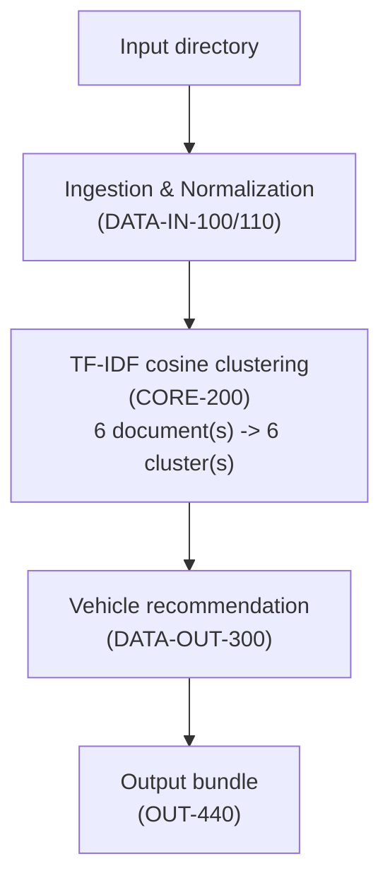

# Analysis Method (OUT-400)

This run ingested **6** document(s) and skipped **1**, then grouped the ingested documents into **6** cluster(s) using TF-IDF cosine-similarity clustering (CORE-200), with a similarity threshold of **0.35** (see `Naadap.Core.TfIdfCosineClusteringComponent` for the threshold's derivation).

## Clusters formed this run

| Cluster | Documents | Top terms |
| --- | --- | --- |
| cluster-0001 | 1 | item, specify, estimated, group, price |
| cluster-0002 | 1 | chebi, aircraft, safety, thank, know |
| cluster-0003 | 1 | calibration, visit, maintenance, dsc, pmv |
| cluster-0004 | 1 | controllers, brand, siemens, notice, standardization |
| cluster-0005 | 1 | surfaces, flooring, area, paint, project |
| cluster-0006 | 1 | experience, cdrl, minimum, engineering, systems |
