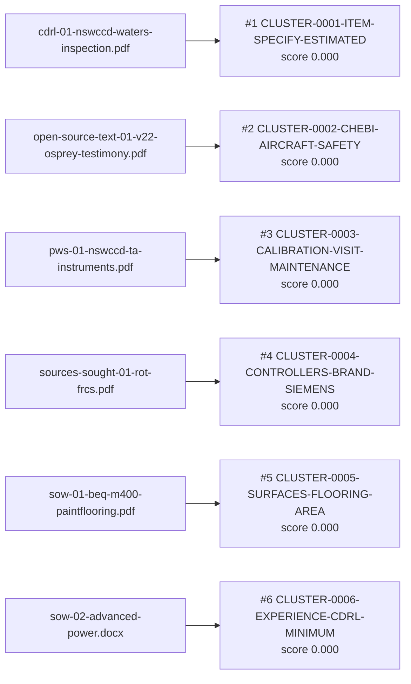

# Results (OUT-410)

**6** candidate vehicle(s) recommended this run, ranked by score (cluster cohesion — see DATA-OUT-300 in docs/SDD.md).

| Rank | Candidate Vehicle | Score | Contributing Documents |
| --- | --- | --- | --- |
| 1 | CLUSTER-0001-ITEM-SPECIFY-ESTIMATED | 0.000 | cdrl-01-nswccd-waters-inspection.pdf |
| 2 | CLUSTER-0002-CHEBI-AIRCRAFT-SAFETY | 0.000 | open-source-text-01-v22-osprey-testimony.pdf |
| 3 | CLUSTER-0003-CALIBRATION-VISIT-MAINTENANCE | 0.000 | pws-01-nswccd-ta-instruments.pdf |
| 4 | CLUSTER-0004-CONTROLLERS-BRAND-SIEMENS | 0.000 | sources-sought-01-rot-frcs.pdf |
| 5 | CLUSTER-0005-SURFACES-FLOORING-AREA | 0.000 | sow-01-beq-m400-paintflooring.pdf |
| 6 | CLUSTER-0006-EXPERIENCE-CDRL-MINIMUM | 0.000 | sow-02-advanced-power.docx |

## Strategic-vehicle candidates per cluster

Candidates are knowledge-base vehicles that survived every evaluable hard constraint, scored as 0.6 × lexical scope overlap + 0.4 × office affinity, ranked with the acquisition-path tier deciding near-ties (within 0.05). Evidence floor 0.05. The complete ranking, including every eliminated vehicle, is in `vehicle-ranking.tsv`. Selection is reserved to the contracting officer and the FAR 7.107 / NMCARS 5237.102 approval authorities.

### cluster-0001

Requesting office(s) found in the documents: none

| Rank | Vehicle | Family | Tier | Score | Lexical | Affinity (office, share) | Matched terms | Deciding key |
| --- | --- | --- | --- | --- | --- | --- | --- | --- |
| 1 | N6833520G3036 | N6833520G3036 | 5 | 0.142 | 0.237 | — | item configuration | score |
| 2 | N0001919D0005 | N0001919D0005 | 1 | 0.070 | 0.117 | — | item software contract line product operating testing delivery | score |
| 3 | N0001923D0018 | N0001923D0018 | 1 | 0.068 | 0.113 | — | item software contract component line system mission | score |
| 4 | GSA-MAS | GSA-MAS | 2 | 0.058 | 0.096 | — | item use dfars subpart supply award part | tier |

Below the evidence floor (480 in total; first 5 shown): N6833520D0032 (0.039); N6893621D0010 (0.027); N0001920D0023 (0.025); SEAPORT-NXG (0.022); N0001920D0017 (0.021)

### cluster-0002

Requesting office(s) found in the documents: N00019

| Rank | Vehicle | Family | Tier | Score | Lexical | Affinity (office, share) | Matched terms | Deciding key |
| --- | --- | --- | --- | --- | --- | --- | --- | --- |
| 1 | NAVAIR-HQ-BOA | NAVAIR-HQ-BOA | 5 | 0.207 | 0.034 | N00019, 0.465 | aircraft engine platform navair equipment new used design | score |

Below the evidence floor (93 in total; first 5 shown): N6134019D1006 (0.048); N0001918D0111 (0.041); N6852020D0012 (0.034); SEAPORT-NXG (0.033); N0001921D0004 (0.032)

Ruled out by hard constraint: OFFICE-NOT-AMONG-OBSERVED-ORDERING-ACTIVITIES × 390 (e.g. FA860423DB001: requesting office(s) N00019 not among FY2025 ordering activities N68520)

### cluster-0003

Requesting office(s) found in the documents: none

| Rank | Vehicle | Family | Tier | Score | Lexical | Affinity (office, share) | Matched terms | Deciding key |
| --- | --- | --- | --- | --- | --- | --- | --- | --- |
| 1 | N6833523D0003 | N6833523D0003 | 1 | 0.128 | 0.213 | — | calibration contract delivery | score |
| 2 | N6893620D0015 | N6893620D0015 | 1 | 0.102 | 0.171 | — | calibration maintenance thermal traceable equipment one calibrations surface | score |
| 3 | N6893620D0016 | N6893620D0016 | 1 | 0.101 | 0.169 | — | calibration visit labor preventative point | score |
| 4 | N6852020D0012 | N6852020D0012 | 1 | 0.096 | 0.160 | — | maintenance | score |
| 5 | N0042120D0010 | N0042120D0010 | 1 | 0.096 | 0.160 | — | maintenance | score |

Below the evidence floor (458 in total; first 5 shown): N0042119D0066 (0.050); N0042122D0094 (0.048); N0001925D0012 (0.047); N0001922D0003 (0.045); NAWCTSD-PACRM (0.045)

### cluster-0004

Requesting office(s) found in the documents: N68520

| Rank | Vehicle | Family | Tier | Score | Lexical | Affinity (office, share) | Matched terms | Deciding key |
| --- | --- | --- | --- | --- | --- | --- | --- | --- |
| 1 | N6852023D0001 | N6852023D0001 | 1 | 0.060 | 0.023 | N68520, 0.117 | labor engineering | score |
| 2 | NASA-SEWP | NASA-SEWP | 3 | 0.052 | 0.069 | N68520, 0.026 | equipment software associated solutions products hardware procurement order | tier |

Below the evidence floor (34 in total; first 5 shown): N6852023D0111 (0.047); SEAPORT-NXG (0.044); N6852021D0002 (0.040); NAWCTSD-PACRM (0.039); NAWCTSD-FTSS-V (0.036)

Ruled out by hard constraint: OFFICE-NOT-AMONG-OBSERVED-ORDERING-ACTIVITIES × 448 (e.g. FA857619D0001: requesting office(s) N68520 not among FY2025 ordering activities N00421,N00019)

### cluster-0005

Requesting office(s) found in the documents: none

| Rank | Vehicle | Family | Tier | Score | Lexical | Affinity (office, share) | Matched terms | Deciding key |
| --- | --- | --- | --- | --- | --- | --- | --- | --- |
| 1 | N6893621D0011 | N6893621D0011 | 1 | 0.064 | 0.107 | — | furniture finishes equipment contract | score |

Below the evidence floor (483 in total; first 5 shown): N0042122D0101 (0.042); N0042120D0007 (0.041); N0042119D0055 (0.039); N6134018D0004 (0.035); N0042121D0010 (0.035)

### cluster-0006

Requesting office(s) found in the documents: none

| Rank | Vehicle | Family | Tier | Score | Lexical | Affinity (office, share) | Matched terms | Deciding key |
| --- | --- | --- | --- | --- | --- | --- | --- | --- |
| 1 | N6893619D0027 | N6893619D0027 | 1 | 0.122 | 0.204 | — | information management technology | score |
| 2 | SEAPORT-NXG | SEAPORT-NXG | 1 | 0.104 | 0.174 | — | engineering management systems technical equipment program related contract | score |
| 3 | N0042121D0010 | N0042121D0010 | 1 | 0.090 | 0.150 | — | system systems management engineering equipment project design navy | score |
| 4 | N0042118D0017 | N0042118D0017 | 1 | 0.082 | 0.137 | — | engineering systems technical labor procurement | score |
| 5 | N6893621D0007 | N6893621D0007 | 1 | 0.074 | 0.124 | — | systems engineering management program testing analysis | score |

Below the evidence floor (447 in total; first 5 shown): N6893618D0036 (0.050); N6893615D0015 (0.049); N0042120D0007 (0.049); N0042119D0024 (0.048); NAWCTSD-FTSS-V (0.048)
